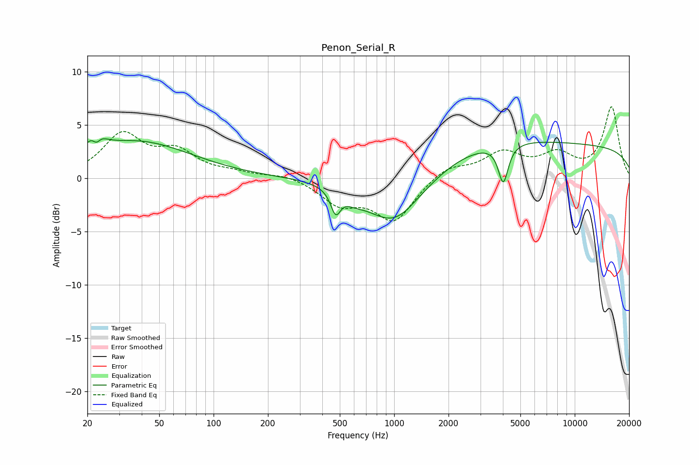

# Penon_Serial_R
See [usage instructions](https://github.com/jaakkopasanen/AutoEq#usage) for more options and info.

### Parametric EQs
Apply preamp of -3.8 dB when using parametric equalizer.

|   # | Type    |   Fc (Hz) |    Q |   Gain (dB) |
|-----|---------|-----------|------|-------------|
|   1 | Peaking |        22 | 3.87 |         3.2 |
|   2 | Peaking |        22 | 5.45 |        -2.6 |
|   3 | Peaking |        37 | 0.47 |         3.4 |
|   4 | Peaking |       474 | 5.28 |        -2.1 |
|   5 | Peaking |       600 | 2.4  |        -0.6 |
|   6 | Peaking |      1007 | 0.82 |        -5.7 |
|   7 | Peaking |      1350 | 2.51 |         0.1 |
|   8 | Peaking |      1837 | 0.32 |         1.8 |
|   9 | Peaking |      4021 | 5.22 |        -3.6 |
|  10 | Peaking |     10000 | 0.18 |         3   |

### Fixed Band EQs
When using fixed band (also called graphic) equalizer, apply preamp of **-6.8 dB** (if available) and set gains manually with these parameters.

|   # | Type    |   Fc (Hz) |    Q |   Gain (dB) |
|-----|---------|-----------|------|-------------|
|   1 | Peaking |        31 | 1.41 |         4   |
|   2 | Peaking |        62 | 1.41 |         2.2 |
|   3 | Peaking |       125 | 1.41 |         0.4 |
|   4 | Peaking |       250 | 1.41 |         0.4 |
|   5 | Peaking |       500 | 1.41 |        -2.2 |
|   6 | Peaking |      1000 | 1.41 |        -3.9 |
|   7 | Peaking |      2000 | 1.41 |         1.2 |
|   8 | Peaking |      4000 | 1.41 |         2.2 |
|   9 | Peaking |      8000 | 1.41 |         2   |
|  10 | Peaking |     16000 | 1.41 |         6.6 |

### Graphs

