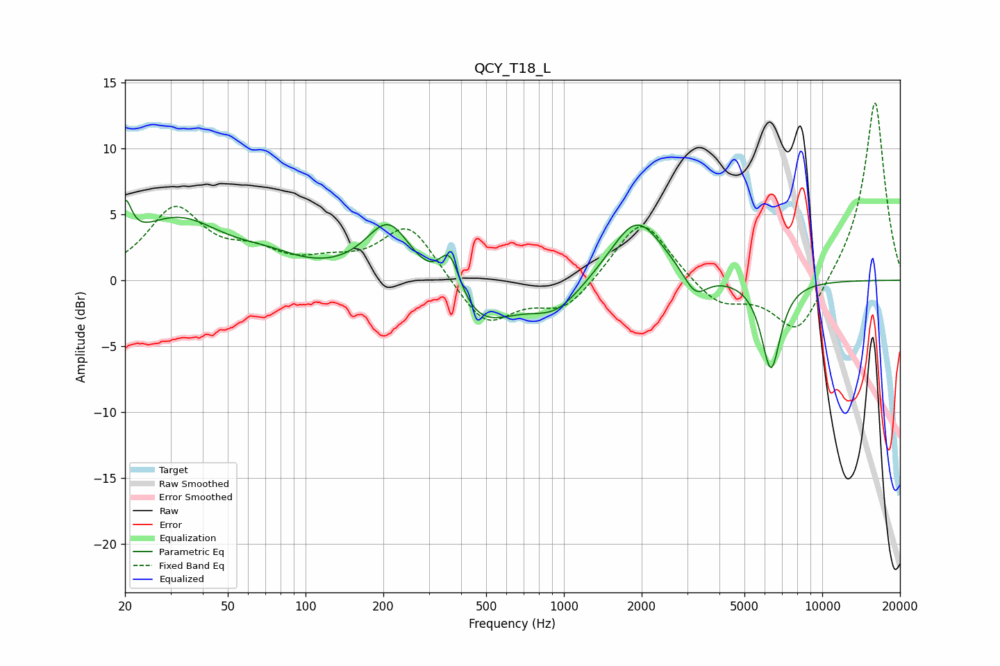

# QCY_T18_L
See [usage instructions](https://github.com/jaakkopasanen/AutoEq#usage) for more options and info.

### Parametric EQs
Apply preamp of -6.2 dB when using parametric equalizer.

|   # | Type    |   Fc (Hz) |    Q |   Gain (dB) |
|-----|---------|-----------|------|-------------|
|   1 | Peaking |        20 | 5.78 |         3.2 |
|   2 | Peaking |        32 | 0.78 |         4.5 |
|   3 | Peaking |        72 | 1.22 |         0.9 |
|   4 | Peaking |       210 | 1.57 |         4.7 |
|   5 | Peaking |       362 | 3.32 |         3.7 |
|   6 | Peaking |       459 | 1    |        -3.7 |
|   7 | Peaking |       933 | 1.38 |        -2.2 |
|   8 | Peaking |      1914 | 1.38 |         4.9 |
|   9 | Peaking |      3228 | 3.02 |        -1.9 |
|  10 | Peaking |      6332 | 3.65 |        -6.8 |

### Fixed Band EQs
When using fixed band (also called graphic) equalizer, apply preamp of **-13.6 dB** (if available) and set gains manually with these parameters.

|   # | Type    |   Fc (Hz) |    Q |   Gain (dB) |
|-----|---------|-----------|------|-------------|
|   1 | Peaking |        31 | 1.41 |         5.2 |
|   2 | Peaking |        62 | 1.41 |         1.6 |
|   3 | Peaking |       125 | 1.41 |         1   |
|   4 | Peaking |       250 | 1.41 |         4.3 |
|   5 | Peaking |       500 | 1.41 |        -3.5 |
|   6 | Peaking |      1000 | 1.41 |        -2.3 |
|   7 | Peaking |      2000 | 1.41 |         5   |
|   8 | Peaking |      4000 | 1.41 |        -2   |
|   9 | Peaking |      8000 | 1.41 |        -4.3 |
|  10 | Peaking |     16000 | 1.41 |        13.8 |

### Graphs

