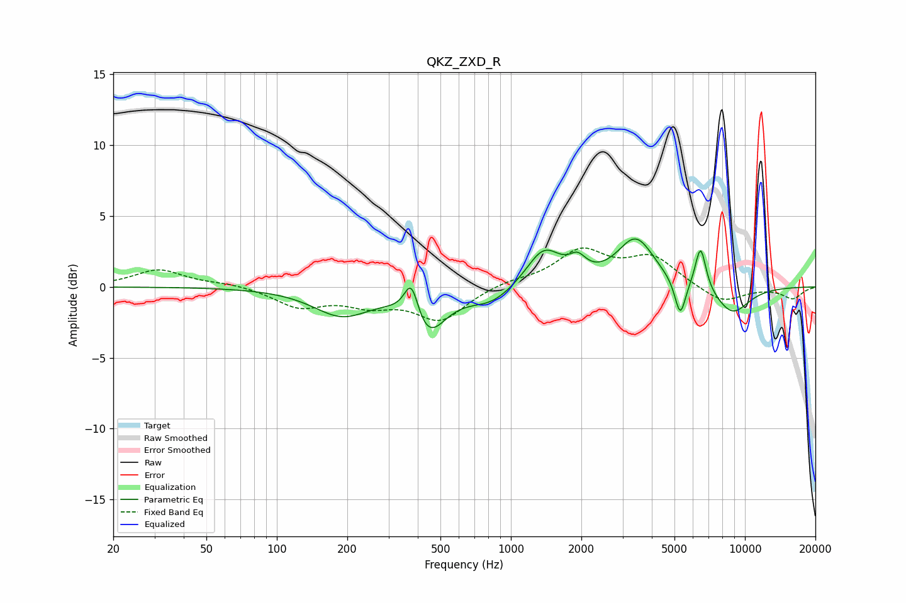

# QKZ_ZXD_R
See [usage instructions](https://github.com/jaakkopasanen/AutoEq#usage) for more options and info.

### Parametric EQs
Apply preamp of -3.5 dB when using parametric equalizer.

|   # | Type    |   Fc (Hz) |    Q |   Gain (dB) |
|-----|---------|-----------|------|-------------|
|   1 | Peaking |       189 | 1.16 |        -1.9 |
|   2 | Peaking |       376 | 4.64 |         2.6 |
|   3 | Peaking |       442 | 1.94 |        -3.1 |
|   4 | Peaking |       826 | 1.46 |        -1.1 |
|   5 | Peaking |      1382 | 1.9  |         2.6 |
|   6 | Peaking |      1929 | 3.96 |         1.1 |
|   7 | Peaking |      3417 | 1.79 |         3.4 |
|   8 | Peaking |      5290 | 6    |        -2.6 |
|   9 | Peaking |      6464 | 5.94 |         3.1 |
|  10 | Peaking |      8829 | 1.72 |        -2   |

### Fixed Band EQs
When using fixed band (also called graphic) equalizer, apply preamp of **-2.8 dB** (if available) and set gains manually with these parameters.

|   # | Type    |   Fc (Hz) |    Q |   Gain (dB) |
|-----|---------|-----------|------|-------------|
|   1 | Peaking |        31 | 1.41 |         1.2 |
|   2 | Peaking |        62 | 1.41 |         0.2 |
|   3 | Peaking |       125 | 1.41 |        -1.3 |
|   4 | Peaking |       250 | 1.41 |        -1.1 |
|   5 | Peaking |       500 | 1.41 |        -2.3 |
|   6 | Peaking |      1000 | 1.41 |         0.4 |
|   7 | Peaking |      2000 | 1.41 |         2.4 |
|   8 | Peaking |      4000 | 1.41 |         2   |
|   9 | Peaking |      8000 | 1.41 |        -1.2 |
|  10 | Peaking |     16000 | 1.41 |        -0.8 |

### Graphs

