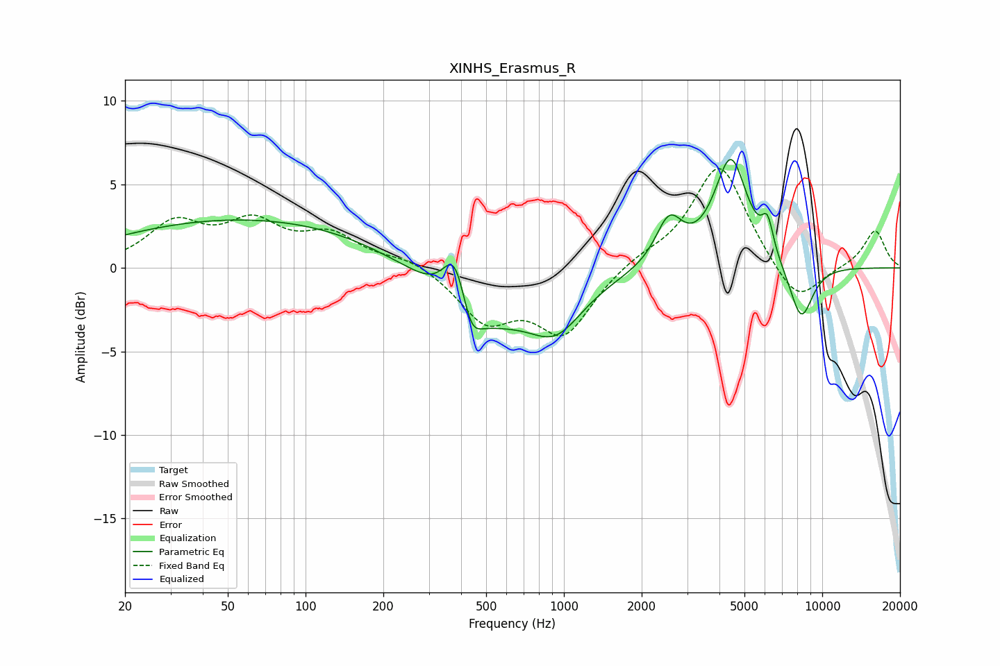

# XINHS_Erasmus_R
See [usage instructions](https://github.com/jaakkopasanen/AutoEq#usage) for more options and info.

### Parametric EQs
Apply preamp of -6.6 dB when using parametric equalizer.

|   # | Type    |   Fc (Hz) |    Q |   Gain (dB) |
|-----|---------|-----------|------|-------------|
|   1 | Peaking |        64 | 0.25 |         3   |
|   2 | Peaking |       309 | 0.92 |         0.8 |
|   3 | Peaking |       379 | 2.99 |         3.6 |
|   4 | Peaking |       434 | 0.71 |        -4.3 |
|   5 | Peaking |       437 | 3.78 |        -1.9 |
|   6 | Peaking |       932 | 1.33 |        -2.8 |
|   7 | Peaking |      2553 | 2.73 |         2.7 |
|   8 | Peaking |      4428 | 2.17 |         6.5 |
|   9 | Peaking |      6143 | 6    |         1.9 |
|  10 | Peaking |      8285 | 2.83 |        -3.4 |

### Fixed Band EQs
When using fixed band (also called graphic) equalizer, apply preamp of **-6.0 dB** (if available) and set gains manually with these parameters.

|   # | Type    |   Fc (Hz) |    Q |   Gain (dB) |
|-----|---------|-----------|------|-------------|
|   1 | Peaking |        31 | 1.41 |         2.5 |
|   2 | Peaking |        62 | 1.41 |         2.4 |
|   3 | Peaking |       125 | 1.41 |         1.8 |
|   4 | Peaking |       250 | 1.41 |         0.6 |
|   5 | Peaking |       500 | 1.41 |        -3   |
|   6 | Peaking |      1000 | 1.41 |        -3.8 |
|   7 | Peaking |      2000 | 1.41 |         0.6 |
|   8 | Peaking |      4000 | 1.41 |         6.3 |
|   9 | Peaking |      8000 | 1.41 |        -2.4 |
|  10 | Peaking |     16000 | 1.41 |         2.3 |

### Graphs

