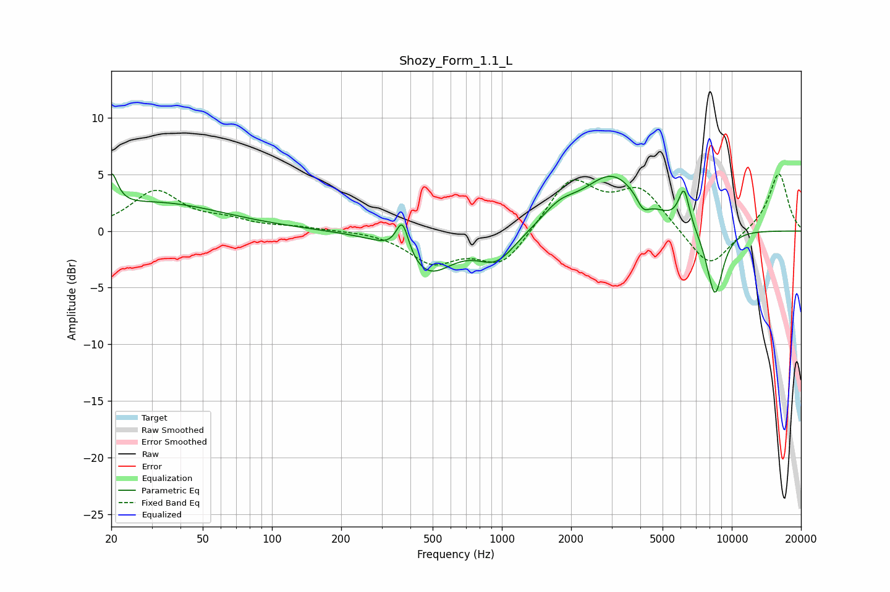

# Shozy_Form_1.1_L
See [usage instructions](https://github.com/jaakkopasanen/AutoEq#usage) for more options and info.

### Parametric EQs
Apply preamp of -5.2 dB when using parametric equalizer.

|   # | Type    |   Fc (Hz) |    Q |   Gain (dB) |
|-----|---------|-----------|------|-------------|
|   1 | Peaking |        20 | 5.41 |         3   |
|   2 | Peaking |        31 | 0.48 |         2.4 |
|   3 | Peaking |       369 | 5.18 |         3   |
|   4 | Peaking |       477 | 1.3  |        -3.6 |
|   5 | Peaking |       947 | 1.66 |        -2.5 |
|   6 | Peaking |      1774 | 1.89 |         1.4 |
|   7 | Peaking |      3023 | 1.09 |         4.8 |
|   8 | Peaking |      4116 | 5.09 |        -1.2 |
|   9 | Peaking |      6201 | 5.8  |         3.2 |
|  10 | Peaking |      8438 | 3.52 |        -6.1 |

### Fixed Band EQs
When using fixed band (also called graphic) equalizer, apply preamp of **-5.1 dB** (if available) and set gains manually with these parameters.

|   # | Type    |   Fc (Hz) |    Q |   Gain (dB) |
|-----|---------|-----------|------|-------------|
|   1 | Peaking |        31 | 1.41 |         3.4 |
|   2 | Peaking |        62 | 1.41 |         0.8 |
|   3 | Peaking |       125 | 1.41 |         0.3 |
|   4 | Peaking |       250 | 1.41 |         0.1 |
|   5 | Peaking |       500 | 1.41 |        -2.6 |
|   6 | Peaking |      1000 | 1.41 |        -3.1 |
|   7 | Peaking |      2000 | 1.41 |         4.6 |
|   8 | Peaking |      4000 | 1.41 |         3.5 |
|   9 | Peaking |      8000 | 1.41 |        -3.5 |
|  10 | Peaking |     16000 | 1.41 |         5.2 |

### Graphs

