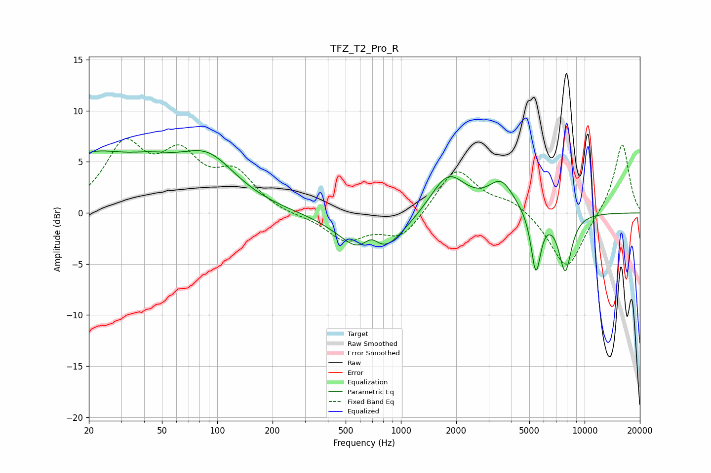

# TFZ_T2_Pro_R
See [usage instructions](https://github.com/jaakkopasanen/AutoEq#usage) for more options and info.

### Parametric EQs
Apply preamp of -6.2 dB when using parametric equalizer.

|   # | Type    |   Fc (Hz) |    Q |   Gain (dB) |
|-----|---------|-----------|------|-------------|
|   1 | Peaking |        20 | 0.66 |         5   |
|   2 | Peaking |        44 | 0.9  |         2.2 |
|   3 | Peaking |        89 | 0.88 |         4.6 |
|   4 | Peaking |       667 | 1.12 |        -2.1 |
|   5 | Peaking |       690 | 2.55 |         3   |
|   6 | Peaking |       711 | 1.15 |        -4.1 |
|   7 | Peaking |      1807 | 1.47 |         4   |
|   8 | Peaking |      3518 | 1.99 |         2.8 |
|   9 | Peaking |      5430 | 5.27 |        -5.9 |
|  10 | Peaking |      7842 | 3.77 |        -5.6 |

### Fixed Band EQs
When using fixed band (also called graphic) equalizer, apply preamp of **-7.4 dB** (if available) and set gains manually with these parameters.

|   # | Type    |   Fc (Hz) |    Q |   Gain (dB) |
|-----|---------|-----------|------|-------------|
|   1 | Peaking |        31 | 1.41 |         6.2 |
|   2 | Peaking |        62 | 1.41 |         4.9 |
|   3 | Peaking |       125 | 1.41 |         3.5 |
|   4 | Peaking |       250 | 1.41 |        -0.3 |
|   5 | Peaking |       500 | 1.41 |        -2.6 |
|   6 | Peaking |      1000 | 1.41 |        -2.5 |
|   7 | Peaking |      2000 | 1.41 |         4.5 |
|   8 | Peaking |      4000 | 1.41 |         1.1 |
|   9 | Peaking |      8000 | 1.41 |        -5.7 |
|  10 | Peaking |     16000 | 1.41 |         7   |

### Graphs

