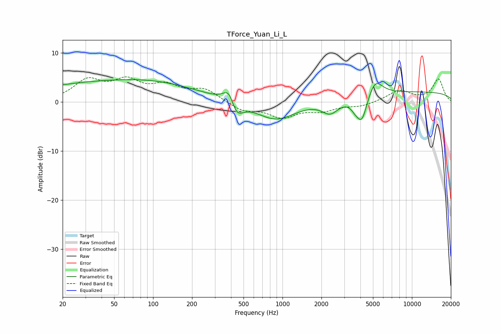

# TForce_Yuan_Li_L
See [usage instructions](https://github.com/jaakkopasanen/AutoEq#usage) for more options and info.

### Parametric EQs
Apply preamp of -4.6 dB when using parametric equalizer.

|   # | Type    |   Fc (Hz) |    Q |   Gain (dB) |
|-----|---------|-----------|------|-------------|
|   1 | Peaking |        48 | 0.22 |         4   |
|   2 | Peaking |       108 | 0.49 |         0.8 |
|   3 | Peaking |       386 | 3.28 |         3.3 |
|   4 | Peaking |       440 | 2.94 |        -3.5 |
|   5 | Peaking |       891 | 0.93 |        -3.9 |
|   6 | Peaking |      2338 | 2.19 |        -2.7 |
|   7 | Peaking |      3628 | 4.65 |        -1   |
|   8 | Peaking |      4102 | 3.34 |        -5.5 |
|   9 | Peaking |      5181 | 2.49 |         3.5 |
|  10 | Peaking |     10000 | 0.18 |         2   |

### Fixed Band EQs
When using fixed band (also called graphic) equalizer, apply preamp of **-5.2 dB** (if available) and set gains manually with these parameters.

|   # | Type    |   Fc (Hz) |    Q |   Gain (dB) |
|-----|---------|-----------|------|-------------|
|   1 | Peaking |        31 | 1.41 |         4.1 |
|   2 | Peaking |        62 | 1.41 |         3.8 |
|   3 | Peaking |       125 | 1.41 |         2.9 |
|   4 | Peaking |       250 | 1.41 |         2.4 |
|   5 | Peaking |       500 | 1.41 |        -1.8 |
|   6 | Peaking |      1000 | 1.41 |        -2.9 |
|   7 | Peaking |      2000 | 1.41 |        -1.5 |
|   8 | Peaking |      4000 | 1.41 |        -0.8 |
|   9 | Peaking |      8000 | 1.41 |         2.3 |
|  10 | Peaking |     16000 | 1.41 |         4.6 |

### Graphs

