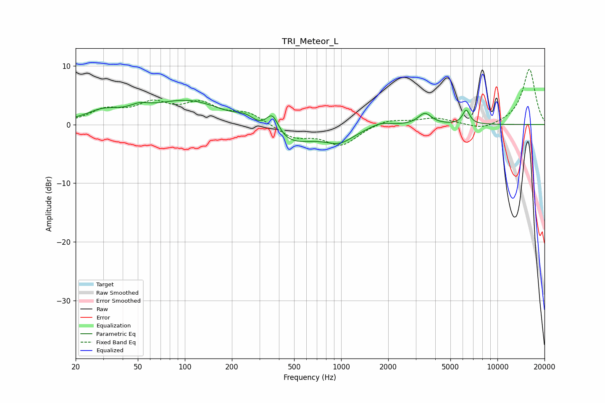

# TRI_Meteor_L
See [usage instructions](https://github.com/jaakkopasanen/AutoEq#usage) for more options and info.

### Parametric EQs
Apply preamp of -4.2 dB when using parametric equalizer.

|   # | Type    |   Fc (Hz) |    Q |   Gain (dB) |
|-----|---------|-----------|------|-------------|
|   1 | Peaking |        30 | 1.29 |         1.7 |
|   2 | Peaking |        51 | 2.32 |         1   |
|   3 | Peaking |       107 | 0.59 |         4.2 |
|   4 | Peaking |       245 | 2.18 |         1.5 |
|   5 | Peaking |       363 | 3.38 |         3.8 |
|   6 | Peaking |       433 | 0.78 |        -3.9 |
|   7 | Peaking |       980 | 1.53 |        -2.2 |
|   8 | Peaking |      1786 | 2.18 |         0.8 |
|   9 | Peaking |      3434 | 3.35 |         1.9 |
|  10 | Peaking |      6308 | 6    |         2.4 |

### Fixed Band EQs
When using fixed band (also called graphic) equalizer, apply preamp of **-9.5 dB** (if available) and set gains manually with these parameters.

|   # | Type    |   Fc (Hz) |    Q |   Gain (dB) |
|-----|---------|-----------|------|-------------|
|   1 | Peaking |        31 | 1.41 |         2.2 |
|   2 | Peaking |        62 | 1.41 |         3.1 |
|   3 | Peaking |       125 | 1.41 |         3.2 |
|   4 | Peaking |       250 | 1.41 |         1.9 |
|   5 | Peaking |       500 | 1.41 |        -2.2 |
|   6 | Peaking |      1000 | 1.41 |        -3.4 |
|   7 | Peaking |      2000 | 1.41 |         1   |
|   8 | Peaking |      4000 | 1.41 |         1.1 |
|   9 | Peaking |      8000 | 1.41 |        -1   |
|  10 | Peaking |     16000 | 1.41 |         9.5 |

### Graphs

