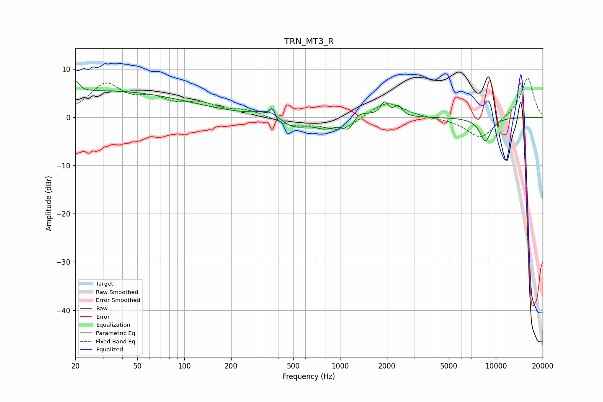

# TRN_MT3_R
See [usage instructions](https://github.com/jaakkopasanen/AutoEq#usage) for more options and info.

### Parametric EQs
Apply preamp of -7.7 dB when using parametric equalizer.

|   # | Type    |   Fc (Hz) |    Q |   Gain (dB) |
|-----|---------|-----------|------|-------------|
|   1 | Peaking |        20 | 6    |         2.5 |
|   2 | Peaking |        32 | 0.26 |         5.4 |
|   3 | Peaking |       353 | 2.07 |         1.6 |
|   4 | Peaking |       500 | 1.59 |        -2.4 |
|   5 | Peaking |       817 | 2.03 |        -2.1 |
|   6 | Peaking |      1145 | 3.3  |        -4.4 |
|   7 | Peaking |      1241 | 2.16 |         3.2 |
|   8 | Peaking |      1930 | 5.99 |         2.8 |
|   9 | Peaking |      2359 | 5.81 |         2.1 |
|  10 | Peaking |      8566 | 3.5  |        -4.9 |

### Fixed Band EQs
When using fixed band (also called graphic) equalizer, apply preamp of **-8.2 dB** (if available) and set gains manually with these parameters.

|   # | Type    |   Fc (Hz) |    Q |   Gain (dB) |
|-----|---------|-----------|------|-------------|
|   1 | Peaking |        31 | 1.41 |         6.5 |
|   2 | Peaking |        62 | 1.41 |         3   |
|   3 | Peaking |       125 | 1.41 |         2.4 |
|   4 | Peaking |       250 | 1.41 |         1.4 |
|   5 | Peaking |       500 | 1.41 |        -1.7 |
|   6 | Peaking |      1000 | 1.41 |        -2.8 |
|   7 | Peaking |      2000 | 1.41 |         3.5 |
|   8 | Peaking |      4000 | 1.41 |        -0.1 |
|   9 | Peaking |      8000 | 1.41 |        -4.5 |
|  10 | Peaking |     16000 | 1.41 |         8.4 |

### Graphs

