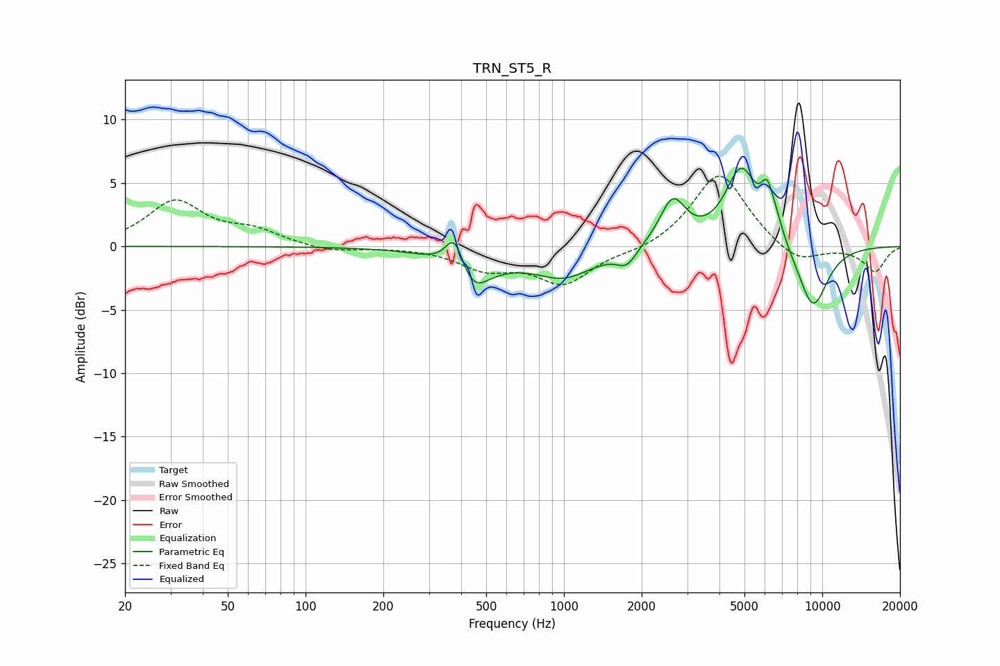

# TRN_ST5_R
See [usage instructions](https://github.com/jaakkopasanen/AutoEq#usage) for more options and info.

### Parametric EQs
Apply preamp of -6.3 dB when using parametric equalizer.

|   # | Type    |   Fc (Hz) |    Q |   Gain (dB) |
|-----|---------|-----------|------|-------------|
|   1 | Peaking |       378 | 3.85 |         3.1 |
|   2 | Peaking |       448 | 1.76 |        -3.9 |
|   3 | Peaking |       505 | 2.71 |         0.6 |
|   4 | Peaking |       998 | 1.17 |        -2.3 |
|   5 | Peaking |      1750 | 3.64 |        -1.3 |
|   6 | Peaking |      2637 | 2.81 |         3.6 |
|   7 | Peaking |      4858 | 2.22 |         6   |
|   8 | Peaking |      6113 | 5.79 |         2.6 |
|   9 | Peaking |      6610 | 4.25 |         1.4 |
|  10 | Peaking |      9201 | 2.12 |        -5.1 |

### Fixed Band EQs
When using fixed band (also called graphic) equalizer, apply preamp of **-5.6 dB** (if available) and set gains manually with these parameters.

|   # | Type    |   Fc (Hz) |    Q |   Gain (dB) |
|-----|---------|-----------|------|-------------|
|   1 | Peaking |        31 | 1.41 |         3.5 |
|   2 | Peaking |        62 | 1.41 |         1.1 |
|   3 | Peaking |       125 | 1.41 |        -0.5 |
|   4 | Peaking |       250 | 1.41 |        -0   |
|   5 | Peaking |       500 | 1.41 |        -1.6 |
|   6 | Peaking |      1000 | 1.41 |        -2.8 |
|   7 | Peaking |      2000 | 1.41 |        -0.4 |
|   8 | Peaking |      4000 | 1.41 |         6   |
|   9 | Peaking |      8000 | 1.41 |        -1.5 |
|  10 | Peaking |     16000 | 1.41 |        -2   |

### Graphs

