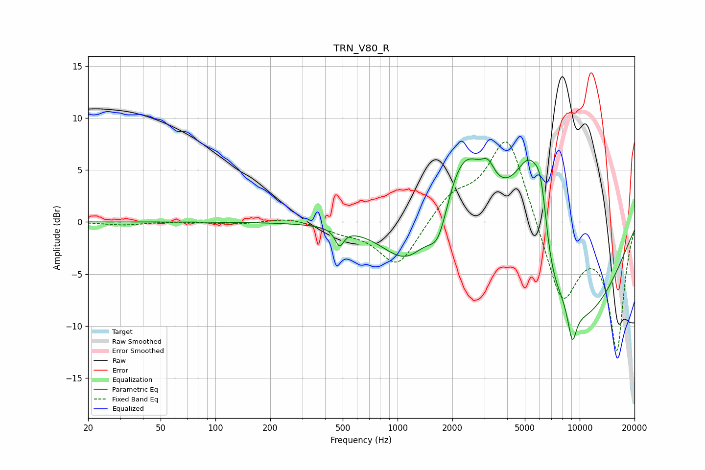

# TRN_V80_R
See [usage instructions](https://github.com/jaakkopasanen/AutoEq#usage) for more options and info.

### Parametric EQs
Apply preamp of -6.2 dB when using parametric equalizer.

|   # | Type    |   Fc (Hz) |    Q |   Gain (dB) |
|-----|---------|-----------|------|-------------|
|   1 | Peaking |       480 | 6    |        -1.6 |
|   2 | Peaking |      1137 | 1.02 |        -4.5 |
|   3 | Peaking |      1678 | 2.64 |        -3.6 |
|   4 | Peaking |      2301 | 1.08 |         8.6 |
|   5 | Peaking |      3139 | 3.9  |         1.7 |
|   6 | Peaking |      5369 | 1.22 |        12.4 |
|   7 | Peaking |      6140 | 4.04 |         3.9 |
|   8 | Peaking |      6931 | 2.65 |        -2.7 |
|   9 | Peaking |      8857 | 0.44 |       -11.7 |
|  10 | Peaking |      9106 | 5.41 |        -3.3 |

### Fixed Band EQs
When using fixed band (also called graphic) equalizer, apply preamp of **-7.8 dB** (if available) and set gains manually with these parameters.

|   # | Type    |   Fc (Hz) |    Q |   Gain (dB) |
|-----|---------|-----------|------|-------------|
|   1 | Peaking |        31 | 1.41 |        -0.3 |
|   2 | Peaking |        62 | 1.41 |         0.1 |
|   3 | Peaking |       125 | 1.41 |        -0.2 |
|   4 | Peaking |       250 | 1.41 |         0.5 |
|   5 | Peaking |       500 | 1.41 |        -0.7 |
|   6 | Peaking |      1000 | 1.41 |        -4.4 |
|   7 | Peaking |      2000 | 1.41 |         2.3 |
|   8 | Peaking |      4000 | 1.41 |         8.8 |
|   9 | Peaking |      8000 | 1.41 |        -7.9 |
|  10 | Peaking |     16000 | 1.41 |       -12.1 |

### Graphs

