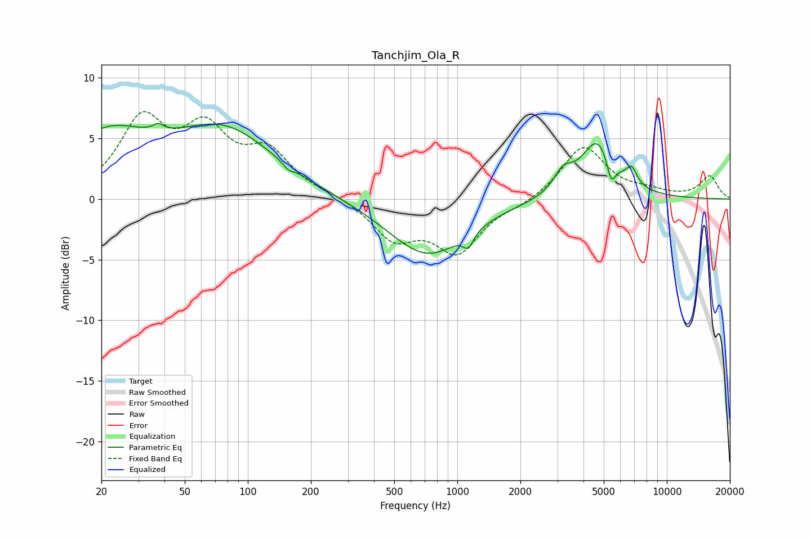

# Tanchjim_Ola_R
See [usage instructions](https://github.com/jaakkopasanen/AutoEq#usage) for more options and info.

### Parametric EQs
Apply preamp of -6.3 dB when using parametric equalizer.

|   # | Type    |   Fc (Hz) |    Q |   Gain (dB) |
|-----|---------|-----------|------|-------------|
|   1 | Peaking |        21 | 0.7  |         4.8 |
|   2 | Peaking |        37 | 5.92 |         0.5 |
|   3 | Peaking |        77 | 0.58 |         5.4 |
|   4 | Peaking |       156 | 5.99 |        -0.4 |
|   5 | Peaking |       719 | 0.76 |        -4.7 |
|   6 | Peaking |      1130 | 5.89 |        -1.2 |
|   7 | Peaking |      3197 | 3.14 |         1.6 |
|   8 | Peaking |      4714 | 1.71 |         4.9 |
|   9 | Peaking |      5420 | 6    |        -2.2 |
|  10 | Peaking |      6793 | 5.43 |         1.3 |

### Fixed Band EQs
When using fixed band (also called graphic) equalizer, apply preamp of **-7.3 dB** (if available) and set gains manually with these parameters.

|   # | Type    |   Fc (Hz) |    Q |   Gain (dB) |
|-----|---------|-----------|------|-------------|
|   1 | Peaking |        31 | 1.41 |         6.1 |
|   2 | Peaking |        62 | 1.41 |         5   |
|   3 | Peaking |       125 | 1.41 |         3.5 |
|   4 | Peaking |       250 | 1.41 |         0.3 |
|   5 | Peaking |       500 | 1.41 |        -3.1 |
|   6 | Peaking |      1000 | 1.41 |        -4.2 |
|   7 | Peaking |      2000 | 1.41 |        -0.4 |
|   8 | Peaking |      4000 | 1.41 |         4.4 |
|   9 | Peaking |      8000 | 1.41 |         0.5 |
|  10 | Peaking |     16000 | 1.41 |         1.9 |

### Graphs

