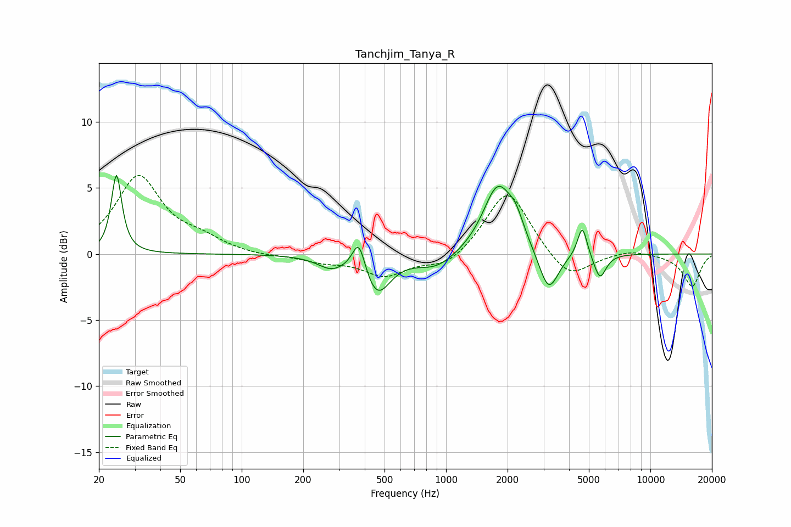

# Tanchjim_Tanya_R
See [usage instructions](https://github.com/jaakkopasanen/AutoEq#usage) for more options and info.

### Parametric EQs
Apply preamp of -6.1 dB when using parametric equalizer.

|   # | Type    |   Fc (Hz) |    Q |   Gain (dB) |
|-----|---------|-----------|------|-------------|
|   1 | Peaking |        24 | 5.94 |         6   |
|   2 | Peaking |       274 | 2.15 |        -0.9 |
|   3 | Peaking |       374 | 4.6  |         2.5 |
|   4 | Peaking |       459 | 2.2  |        -3   |
|   5 | Peaking |       897 | 1.48 |        -1.1 |
|   6 | Peaking |      1789 | 1.97 |         5.1 |
|   7 | Peaking |      2199 | 3.58 |         1.4 |
|   8 | Peaking |      3177 | 2.96 |        -3.2 |
|   9 | Peaking |      4645 | 6    |         2.4 |
|  10 | Peaking |      5663 | 4.65 |        -1.9 |

### Fixed Band EQs
When using fixed band (also called graphic) equalizer, apply preamp of **-6.0 dB** (if available) and set gains manually with these parameters.

|   # | Type    |   Fc (Hz) |    Q |   Gain (dB) |
|-----|---------|-----------|------|-------------|
|   1 | Peaking |        31 | 1.41 |         5.8 |
|   2 | Peaking |        62 | 1.41 |         0.9 |
|   3 | Peaking |       125 | 1.41 |        -0.2 |
|   4 | Peaking |       250 | 1.41 |        -0.5 |
|   5 | Peaking |       500 | 1.41 |        -1.6 |
|   6 | Peaking |      1000 | 1.41 |        -1.1 |
|   7 | Peaking |      2000 | 1.41 |         5   |
|   8 | Peaking |      4000 | 1.41 |        -2.1 |
|   9 | Peaking |      8000 | 1.41 |         0.4 |
|  10 | Peaking |     16000 | 1.41 |        -2.5 |

### Graphs

