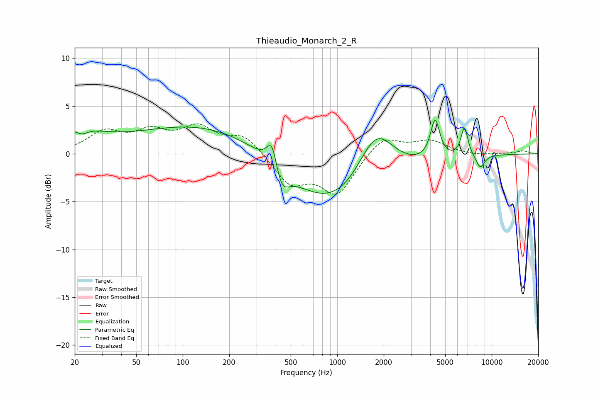

# Thieaudio_Monarch_2_R
See [usage instructions](https://github.com/jaakkopasanen/AutoEq#usage) for more options and info.

### Parametric EQs
Apply preamp of -3.6 dB when using parametric equalizer.

|   # | Type    |   Fc (Hz) |    Q |   Gain (dB) |
|-----|---------|-----------|------|-------------|
|   1 | Peaking |        20 | 0.78 |         2.1 |
|   2 | Peaking |        22 | 4.06 |        -0.6 |
|   3 | Peaking |       149 | 0.31 |         3.2 |
|   4 | Peaking |       379 | 4.18 |         3.1 |
|   5 | Peaking |       433 | 3.02 |        -2.7 |
|   6 | Peaking |      1036 | 0.42 |        -6.7 |
|   7 | Peaking |      1774 | 1.1  |         6.6 |
|   8 | Peaking |      4302 | 4.69 |         4.1 |
|   9 | Peaking |      6666 | 6    |         3.1 |
|  10 | Peaking |      8438 | 4.69 |        -1.4 |

### Fixed Band EQs
When using fixed band (also called graphic) equalizer, apply preamp of **-3.2 dB** (if available) and set gains manually with these parameters.

|   # | Type    |   Fc (Hz) |    Q |   Gain (dB) |
|-----|---------|-----------|------|-------------|
|   1 | Peaking |        31 | 1.41 |         2.1 |
|   2 | Peaking |        62 | 1.41 |         2   |
|   3 | Peaking |       125 | 1.41 |         2.5 |
|   4 | Peaking |       250 | 1.41 |         1.9 |
|   5 | Peaking |       500 | 1.41 |        -3   |
|   6 | Peaking |      1000 | 1.41 |        -4.1 |
|   7 | Peaking |      2000 | 1.41 |         1.9 |
|   8 | Peaking |      4000 | 1.41 |         1.3 |
|   9 | Peaking |      8000 | 1.41 |        -0.2 |
|  10 | Peaking |     16000 | 1.41 |         0.3 |

### Graphs

