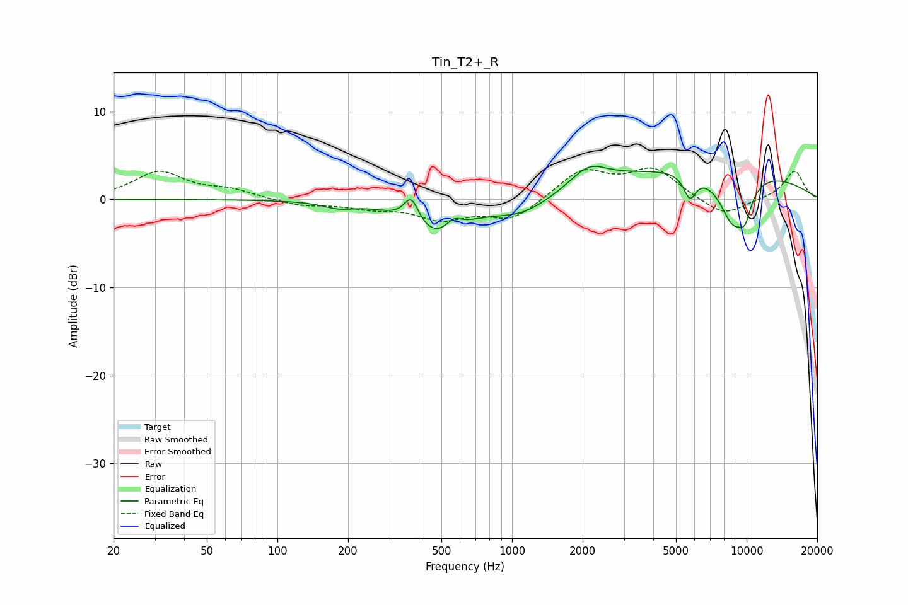

# Tin_T2+_R
See [usage instructions](https://github.com/jaakkopasanen/AutoEq#usage) for more options and info.

### Parametric EQs
Apply preamp of -3.9 dB when using parametric equalizer.

|   # | Type    |   Fc (Hz) |    Q |   Gain (dB) |
|-----|---------|-----------|------|-------------|
|   1 | Peaking |       183 | 2.14 |        -0.6 |
|   2 | Peaking |       372 | 4.5  |         2.9 |
|   3 | Peaking |       474 | 1.2  |        -4   |
|   4 | Peaking |       564 | 4.29 |         1.3 |
|   5 | Peaking |      1105 | 1.1  |        -2   |
|   6 | Peaking |      2125 | 1.83 |         2.2 |
|   7 | Peaking |      5729 | 5.31 |        -2.7 |
|   8 | Peaking |      6849 | 0.27 |         3.9 |
|   9 | Peaking |      8779 | 2.08 |        -6   |
|  10 | Peaking |      9865 | 4.82 |        -2.4 |

### Fixed Band EQs
When using fixed band (also called graphic) equalizer, apply preamp of **-3.7 dB** (if available) and set gains manually with these parameters.

|   # | Type    |   Fc (Hz) |    Q |   Gain (dB) |
|-----|---------|-----------|------|-------------|
|   1 | Peaking |        31 | 1.41 |         3.1 |
|   2 | Peaking |        62 | 1.41 |         1   |
|   3 | Peaking |       125 | 1.41 |        -0.7 |
|   4 | Peaking |       250 | 1.41 |        -0.8 |
|   5 | Peaking |       500 | 1.41 |        -2.1 |
|   6 | Peaking |      1000 | 1.41 |        -2.3 |
|   7 | Peaking |      2000 | 1.41 |         3.3 |
|   8 | Peaking |      4000 | 1.41 |         3.3 |
|   9 | Peaking |      8000 | 1.41 |        -2   |
|  10 | Peaking |     16000 | 1.41 |         3.3 |

### Graphs

