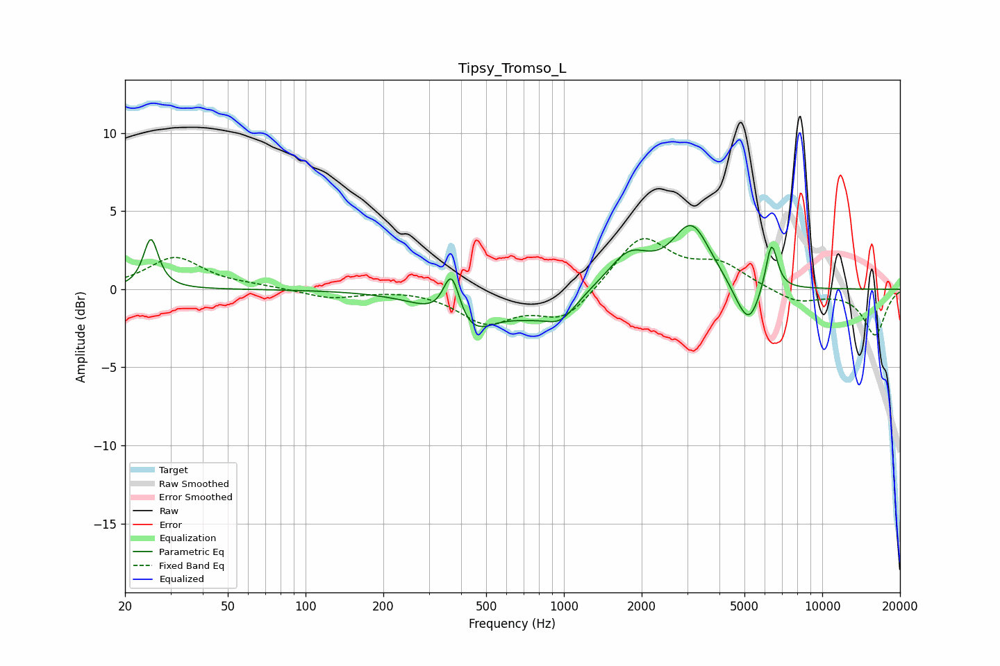

# Tipsy_Tromso_L
See [usage instructions](https://github.com/jaakkopasanen/AutoEq#usage) for more options and info.

### Parametric EQs
Apply preamp of -4.2 dB when using parametric equalizer.

|   # | Type    |   Fc (Hz) |    Q |   Gain (dB) |
|-----|---------|-----------|------|-------------|
|   1 | Peaking |        25 | 5.11 |         3.2 |
|   2 | Peaking |       367 | 4.22 |         3.5 |
|   3 | Peaking |       419 | 1.28 |        -3   |
|   4 | Peaking |       730 | 1.73 |        -0.7 |
|   5 | Peaking |       969 | 2.15 |        -1.6 |
|   6 | Peaking |      1786 | 1.77 |         2.2 |
|   7 | Peaking |      3121 | 1.93 |         3.9 |
|   8 | Peaking |      4701 | 3.42 |        -0.4 |
|   9 | Peaking |      5205 | 3.16 |        -2.5 |
|  10 | Peaking |      6362 | 5.99 |         3.2 |

### Fixed Band EQs
When using fixed band (also called graphic) equalizer, apply preamp of **-3.3 dB** (if available) and set gains manually with these parameters.

|   # | Type    |   Fc (Hz) |    Q |   Gain (dB) |
|-----|---------|-----------|------|-------------|
|   1 | Peaking |        31 | 1.41 |         2   |
|   2 | Peaking |        62 | 1.41 |         0.2 |
|   3 | Peaking |       125 | 1.41 |        -0.6 |
|   4 | Peaking |       250 | 1.41 |         0.1 |
|   5 | Peaking |       500 | 1.41 |        -2   |
|   6 | Peaking |      1000 | 1.41 |        -2   |
|   7 | Peaking |      2000 | 1.41 |         3.4 |
|   8 | Peaking |      4000 | 1.41 |         1.5 |
|   9 | Peaking |      8000 | 1.41 |        -0.9 |
|  10 | Peaking |     16000 | 1.41 |        -2.9 |

### Graphs

