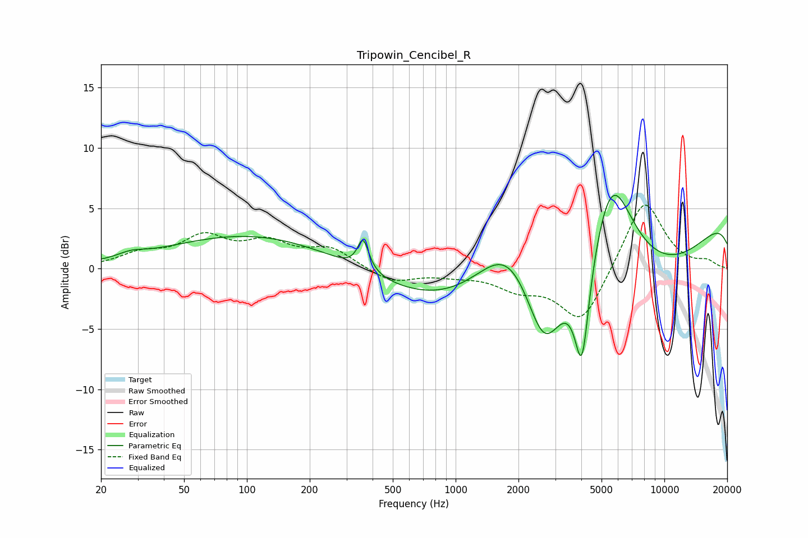

# Tripowin_Cencibel_R
See [usage instructions](https://github.com/jaakkopasanen/AutoEq#usage) for more options and info.

### Parametric EQs
Apply preamp of -6.2 dB when using parametric equalizer.

|   # | Type    |   Fc (Hz) |    Q |   Gain (dB) |
|-----|---------|-----------|------|-------------|
|   1 | Peaking |        28 | 2.3  |         0.4 |
|   2 | Peaking |       162 | 0.25 |         3.5 |
|   3 | Peaking |       360 | 5.38 |         2.6 |
|   4 | Peaking |      1445 | 0.19 |        -5.3 |
|   5 | Peaking |      1810 | 0.87 |         6.4 |
|   6 | Peaking |      2650 | 1.63 |        -6.2 |
|   7 | Peaking |      4031 | 3.96 |        -8.5 |
|   8 | Peaking |      5576 | 1.17 |        10.7 |
|   9 | Peaking |      7744 | 0.27 |        -9.1 |
|  10 | Peaking |     10000 | 0.19 |         8.9 |

### Fixed Band EQs
When using fixed band (also called graphic) equalizer, apply preamp of **-5.3 dB** (if available) and set gains manually with these parameters.

|   # | Type    |   Fc (Hz) |    Q |   Gain (dB) |
|-----|---------|-----------|------|-------------|
|   1 | Peaking |        31 | 1.41 |         1.1 |
|   2 | Peaking |        62 | 1.41 |         2.4 |
|   3 | Peaking |       125 | 1.41 |         1.9 |
|   4 | Peaking |       250 | 1.41 |         1.6 |
|   5 | Peaking |       500 | 1.41 |        -1.2 |
|   6 | Peaking |      1000 | 1.41 |        -0.4 |
|   7 | Peaking |      2000 | 1.41 |        -1.4 |
|   8 | Peaking |      4000 | 1.41 |        -4.5 |
|   9 | Peaking |      8000 | 1.41 |         5.9 |
|  10 | Peaking |     16000 | 1.41 |         0.5 |

### Graphs

