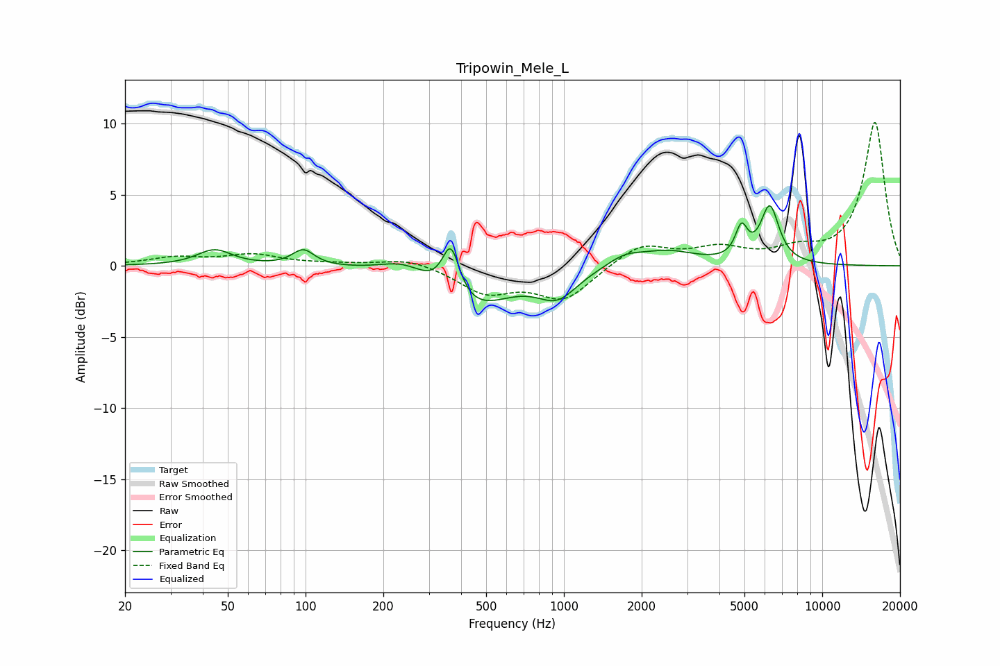

# Tripowin_Mele_L
See [usage instructions](https://github.com/jaakkopasanen/AutoEq#usage) for more options and info.

### Parametric EQs
Apply preamp of -4.3 dB when using parametric equalizer.

|   # | Type    |   Fc (Hz) |    Q |   Gain (dB) |
|-----|---------|-----------|------|-------------|
|   1 | Peaking |        44 | 2.14 |         1.1 |
|   2 | Peaking |        98 | 3.38 |         1.1 |
|   3 | Peaking |       239 | 1.59 |         1   |
|   4 | Peaking |       365 | 4.18 |         3.6 |
|   5 | Peaking |       439 | 0.98 |        -3   |
|   6 | Peaking |       943 | 1.84 |        -1.9 |
|   7 | Peaking |      1717 | 2.06 |         0.7 |
|   8 | Peaking |      2506 | 1.23 |         1   |
|   9 | Peaking |      4868 | 5.99 |         2.1 |
|  10 | Peaking |      6268 | 3.88 |         4   |

### Fixed Band EQs
When using fixed band (also called graphic) equalizer, apply preamp of **-10.2 dB** (if available) and set gains manually with these parameters.

|   # | Type    |   Fc (Hz) |    Q |   Gain (dB) |
|-----|---------|-----------|------|-------------|
|   1 | Peaking |        31 | 1.41 |         0.5 |
|   2 | Peaking |        62 | 1.41 |         0.7 |
|   3 | Peaking |       125 | 1.41 |         0.1 |
|   4 | Peaking |       250 | 1.41 |         0.6 |
|   5 | Peaking |       500 | 1.41 |        -1.8 |
|   6 | Peaking |      1000 | 1.41 |        -2.3 |
|   7 | Peaking |      2000 | 1.41 |         1.6 |
|   8 | Peaking |      4000 | 1.41 |         1.1 |
|   9 | Peaking |      8000 | 1.41 |         0.9 |
|  10 | Peaking |     16000 | 1.41 |        10.1 |

### Graphs

