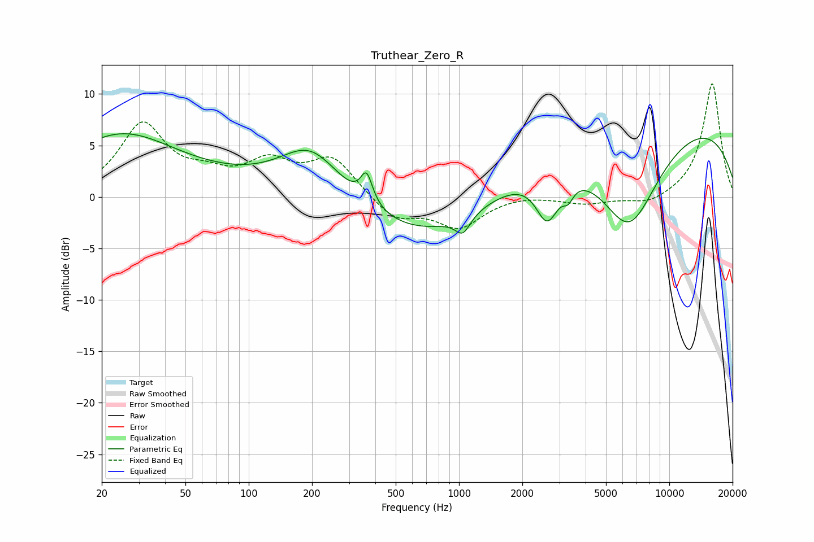

# Truthear_Zero_R
See [usage instructions](https://github.com/jaakkopasanen/AutoEq#usage) for more options and info.

### Parametric EQs
Apply preamp of -6.2 dB when using parametric equalizer.

|   # | Type    |   Fc (Hz) |    Q |   Gain (dB) |
|-----|---------|-----------|------|-------------|
|   1 | Peaking |        24 | 0.55 |         5.2 |
|   2 | Peaking |        92 | 0.18 |         1.2 |
|   3 | Peaking |       198 | 0.98 |         4.6 |
|   4 | Peaking |       364 | 5.06 |         2.9 |
|   5 | Peaking |       685 | 0.42 |        -4.8 |
|   6 | Peaking |      1043 | 4    |        -1.7 |
|   7 | Peaking |      2628 | 2.56 |        -4.7 |
|   8 | Peaking |      3306 | 5.68 |        -1.3 |
|   9 | Peaking |      6435 | 0.89 |       -10.3 |
|  10 | Peaking |      8051 | 0.18 |         8.4 |

### Fixed Band EQs
When using fixed band (also called graphic) equalizer, apply preamp of **-11.1 dB** (if available) and set gains manually with these parameters.

|   # | Type    |   Fc (Hz) |    Q |   Gain (dB) |
|-----|---------|-----------|------|-------------|
|   1 | Peaking |        31 | 1.41 |         6.9 |
|   2 | Peaking |        62 | 1.41 |         1.5 |
|   3 | Peaking |       125 | 1.41 |         3   |
|   4 | Peaking |       250 | 1.41 |         3.6 |
|   5 | Peaking |       500 | 1.41 |        -2.2 |
|   6 | Peaking |      1000 | 1.41 |        -2.8 |
|   7 | Peaking |      2000 | 1.41 |         0.3 |
|   8 | Peaking |      4000 | 1.41 |        -0.7 |
|   9 | Peaking |      8000 | 1.41 |        -0.8 |
|  10 | Peaking |     16000 | 1.41 |        11.1 |

### Graphs

