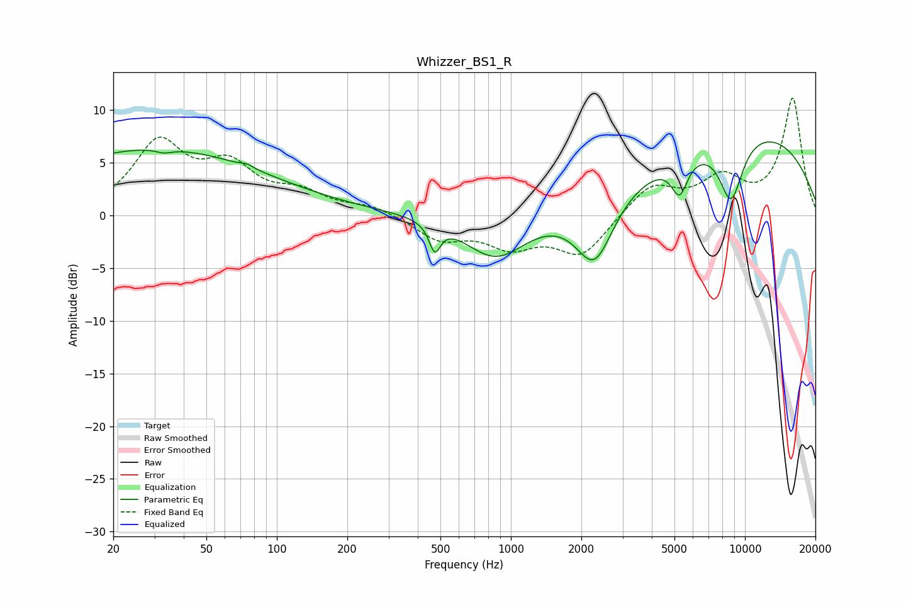

# Whizzer_BS1_R
See [usage instructions](https://github.com/jaakkopasanen/AutoEq#usage) for more options and info.

### Parametric EQs
Apply preamp of -7.1 dB when using parametric equalizer.

|   # | Type    |   Fc (Hz) |    Q |   Gain (dB) |
|-----|---------|-----------|------|-------------|
|   1 | Peaking |        30 | 0.29 |         6.3 |
|   2 | Peaking |        33 | 4.23 |        -0.4 |
|   3 | Peaking |        75 | 5.77 |         0.3 |
|   4 | Peaking |       473 | 6    |        -2.6 |
|   5 | Peaking |       862 | 1.02 |        -4.6 |
|   6 | Peaking |      1016 | 0.38 |         0.6 |
|   7 | Peaking |      2277 | 1.73 |        -6.4 |
|   8 | Peaking |      5256 | 3.99 |        -3.4 |
|   9 | Peaking |      8718 | 2.5  |        -6.2 |
|  10 | Peaking |     10000 | 0.28 |         8.1 |

### Fixed Band EQs
When using fixed band (also called graphic) equalizer, apply preamp of **-11.2 dB** (if available) and set gains manually with these parameters.

|   # | Type    |   Fc (Hz) |    Q |   Gain (dB) |
|-----|---------|-----------|------|-------------|
|   1 | Peaking |        31 | 1.41 |         6.6 |
|   2 | Peaking |        62 | 1.41 |         4.1 |
|   3 | Peaking |       125 | 1.41 |         1.8 |
|   4 | Peaking |       250 | 1.41 |         0.8 |
|   5 | Peaking |       500 | 1.41 |        -2.2 |
|   6 | Peaking |      1000 | 1.41 |        -2.6 |
|   7 | Peaking |      2000 | 1.41 |        -3.7 |
|   8 | Peaking |      4000 | 1.41 |         2.9 |
|   9 | Peaking |      8000 | 1.41 |         3.2 |
|  10 | Peaking |     16000 | 1.41 |        11   |

### Graphs

