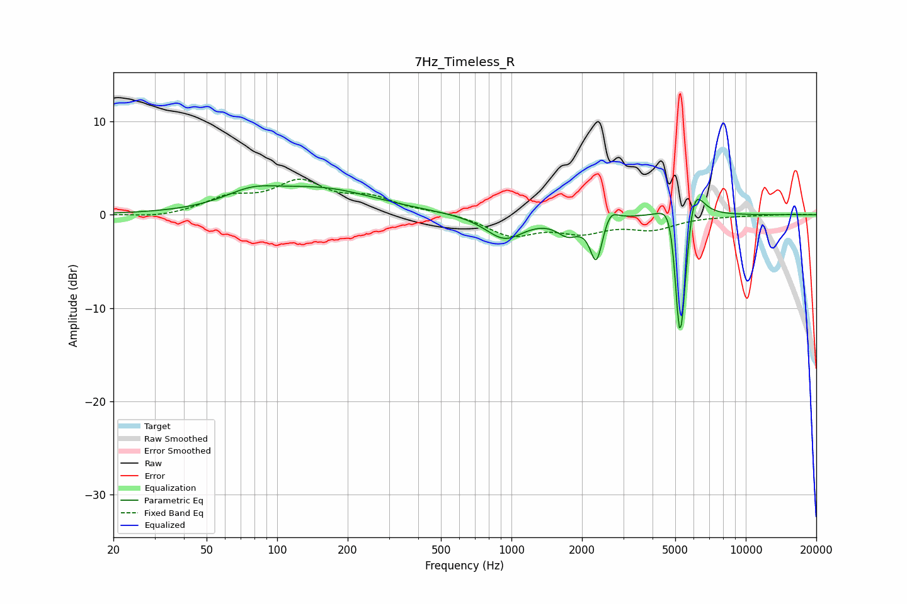

# 7Hz_Timeless_R
See [usage instructions](https://github.com/jaakkopasanen/AutoEq#usage) for more options and info.

### Parametric EQs
Apply preamp of -3.2 dB when using parametric equalizer.

|   # | Type    |   Fc (Hz) |    Q |   Gain (dB) |
|-----|---------|-----------|------|-------------|
|   1 | Peaking |        78 | 1.24 |         1.5 |
|   2 | Peaking |       155 | 0.6  |         2.6 |
|   3 | Peaking |       934 | 1.73 |        -2.6 |
|   4 | Peaking |      1742 | 3    |        -1.7 |
|   5 | Peaking |      2304 | 5.36 |        -4.8 |
|   6 | Peaking |      2633 | 4.72 |         1.5 |
|   7 | Peaking |      4820 | 3.55 |         4.2 |
|   8 | Peaking |      5206 | 6    |       -13   |
|   9 | Peaking |      5383 | 6    |        -5.3 |
|  10 | Peaking |      5969 | 3.57 |         4.8 |

### Fixed Band EQs
When using fixed band (also called graphic) equalizer, apply preamp of **-3.9 dB** (if available) and set gains manually with these parameters.

|   # | Type    |   Fc (Hz) |    Q |   Gain (dB) |
|-----|---------|-----------|------|-------------|
|   1 | Peaking |        31 | 1.41 |        -0.4 |
|   2 | Peaking |        62 | 1.41 |         1.6 |
|   3 | Peaking |       125 | 1.41 |         3.2 |
|   4 | Peaking |       250 | 1.41 |         1.6 |
|   5 | Peaking |       500 | 1.41 |         0.3 |
|   6 | Peaking |      1000 | 1.41 |        -2.1 |
|   7 | Peaking |      2000 | 1.41 |        -1.6 |
|   8 | Peaking |      4000 | 1.41 |        -1.4 |
|   9 | Peaking |      8000 | 1.41 |        -0.1 |
|  10 | Peaking |     16000 | 1.41 |         0.1 |

### Graphs

