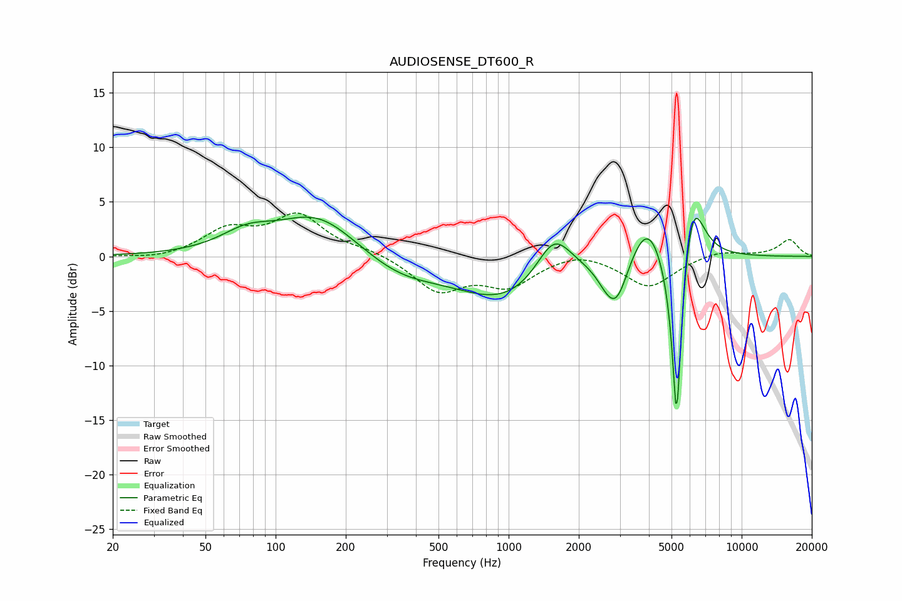

# AUDIOSENSE_DT600_R
See [usage instructions](https://github.com/jaakkopasanen/AutoEq#usage) for more options and info.

### Parametric EQs
Apply preamp of -3.7 dB when using parametric equalizer.

|   # | Type    |   Fc (Hz) |    Q |   Gain (dB) |
|-----|---------|-----------|------|-------------|
|   1 | Peaking |        75 | 1.26 |         1.7 |
|   2 | Peaking |       152 | 0.83 |         3.9 |
|   3 | Peaking |       341 | 0.82 |        -1.8 |
|   4 | Peaking |       969 | 0.67 |        -4   |
|   5 | Peaking |      1565 | 1.85 |         4   |
|   6 | Peaking |      2655 | 2.9  |        -1.5 |
|   7 | Peaking |      2926 | 3.01 |        -3.4 |
|   8 | Peaking |      3961 | 2    |         4.1 |
|   9 | Peaking |      5259 | 6    |       -18.6 |
|  10 | Peaking |      6151 | 2.85 |         6.8 |

### Fixed Band EQs
When using fixed band (also called graphic) equalizer, apply preamp of **-4.1 dB** (if available) and set gains manually with these parameters.

|   # | Type    |   Fc (Hz) |    Q |   Gain (dB) |
|-----|---------|-----------|------|-------------|
|   1 | Peaking |        31 | 1.41 |        -0.3 |
|   2 | Peaking |        62 | 1.41 |         2.3 |
|   3 | Peaking |       125 | 1.41 |         3.6 |
|   4 | Peaking |       250 | 1.41 |         0.5 |
|   5 | Peaking |       500 | 1.41 |        -3.1 |
|   6 | Peaking |      1000 | 1.41 |        -2.5 |
|   7 | Peaking |      2000 | 1.41 |         0.7 |
|   8 | Peaking |      4000 | 1.41 |        -2.8 |
|   9 | Peaking |      8000 | 1.41 |         0.6 |
|  10 | Peaking |     16000 | 1.41 |         1.5 |

### Graphs

