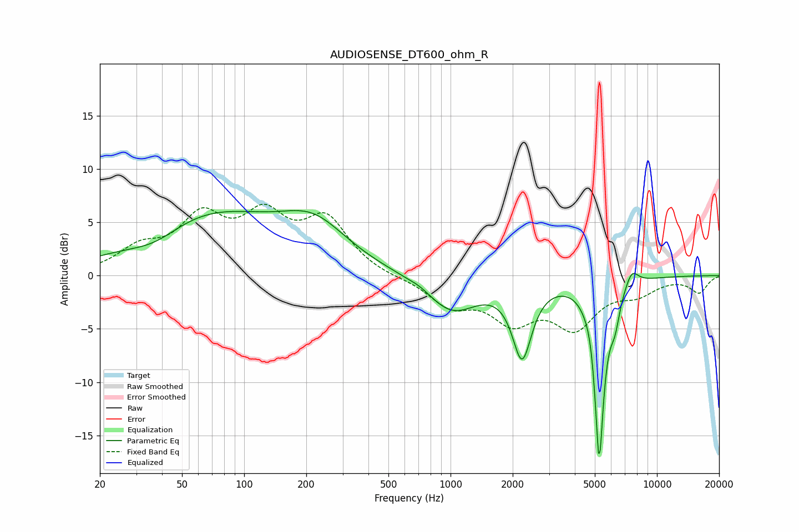

# AUDIOSENSE_DT600_ohm_R
See [usage instructions](https://github.com/jaakkopasanen/AutoEq#usage) for more options and info.

### Parametric EQs
Apply preamp of -6.2 dB when using parametric equalizer.

|   # | Type    |   Fc (Hz) |    Q |   Gain (dB) |
|-----|---------|-----------|------|-------------|
|   1 | Peaking |        37 | 1.1  |        -1.5 |
|   2 | Peaking |        66 | 0.41 |         5.7 |
|   3 | Peaking |       218 | 0.86 |         3.6 |
|   4 | Peaking |       709 | 3.15 |         0.2 |
|   5 | Peaking |      1017 | 1.15 |        -3.4 |
|   6 | Peaking |      2221 | 3.02 |        -7.1 |
|   7 | Peaking |      4794 | 6    |         0.9 |
|   8 | Peaking |      5248 | 5.81 |       -17   |
|   9 | Peaking |      6260 | 6    |        -2.4 |
|  10 | Peaking |      7550 | 4.25 |         1.5 |

### Fixed Band EQs
When using fixed band (also called graphic) equalizer, apply preamp of **-6.8 dB** (if available) and set gains manually with these parameters.

|   # | Type    |   Fc (Hz) |    Q |   Gain (dB) |
|-----|---------|-----------|------|-------------|
|   1 | Peaking |        31 | 1.41 |         2.2 |
|   2 | Peaking |        62 | 1.41 |         4.9 |
|   3 | Peaking |       125 | 1.41 |         4.8 |
|   4 | Peaking |       250 | 1.41 |         4.9 |
|   5 | Peaking |       500 | 1.41 |        -0.2 |
|   6 | Peaking |      1000 | 1.41 |        -2.6 |
|   7 | Peaking |      2000 | 1.41 |        -3.8 |
|   8 | Peaking |      4000 | 1.41 |        -4.4 |
|   9 | Peaking |      8000 | 1.41 |        -1.4 |
|  10 | Peaking |     16000 | 1.41 |        -1.5 |

### Graphs

