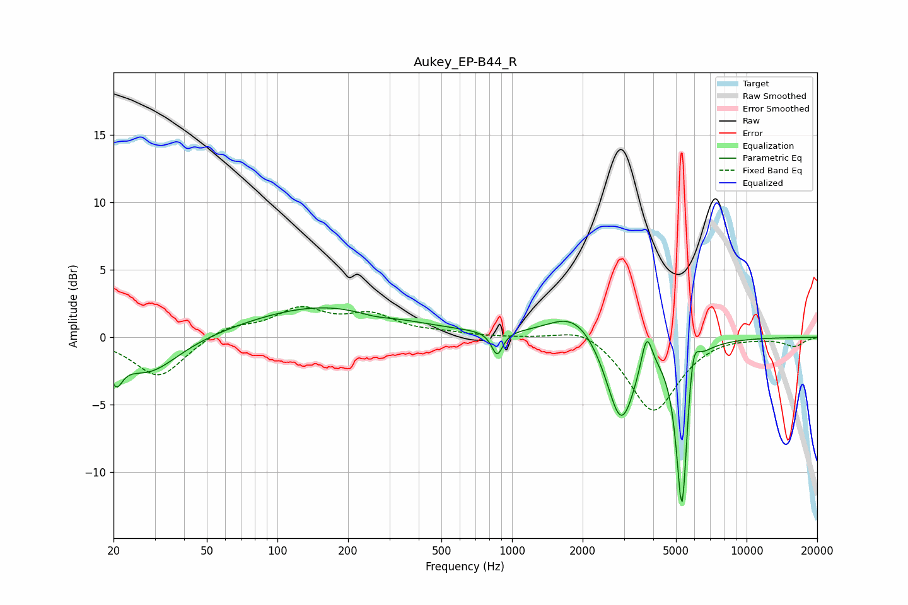

# Aukey_EP-B44_R
See [usage instructions](https://github.com/jaakkopasanen/AutoEq#usage) for more options and info.

### Parametric EQs
Apply preamp of -2.3 dB when using parametric equalizer.

|   # | Type    |   Fc (Hz) |    Q |   Gain (dB) |
|-----|---------|-----------|------|-------------|
|   1 | Peaking |        21 | 5.29 |        -2   |
|   2 | Peaking |        28 | 1.1  |        -2.7 |
|   3 | Peaking |       157 | 0.45 |         2.3 |
|   4 | Peaking |       259 | 1.9  |        -0.3 |
|   5 | Peaking |       865 | 5.99 |        -1.8 |
|   6 | Peaking |      1854 | 1.3  |         2.1 |
|   7 | Peaking |      2918 | 2.27 |        -6.6 |
|   8 | Peaking |      3749 | 6    |         2.8 |
|   9 | Peaking |      5305 | 5.64 |       -13.1 |
|  10 | Peaking |      5894 | 5.85 |         3.3 |

### Fixed Band EQs
When using fixed band (also called graphic) equalizer, apply preamp of **-2.4 dB** (if available) and set gains manually with these parameters.

|   # | Type    |   Fc (Hz) |    Q |   Gain (dB) |
|-----|---------|-----------|------|-------------|
|   1 | Peaking |        31 | 1.41 |        -3   |
|   2 | Peaking |        62 | 1.41 |         0.8 |
|   3 | Peaking |       125 | 1.41 |         1.9 |
|   4 | Peaking |       250 | 1.41 |         1.5 |
|   5 | Peaking |       500 | 1.41 |         0.2 |
|   6 | Peaking |      1000 | 1.41 |        -0   |
|   7 | Peaking |      2000 | 1.41 |         1   |
|   8 | Peaking |      4000 | 1.41 |        -5.6 |
|   9 | Peaking |      8000 | 1.41 |         0.2 |
|  10 | Peaking |     16000 | 1.41 |        -0.6 |

### Graphs

