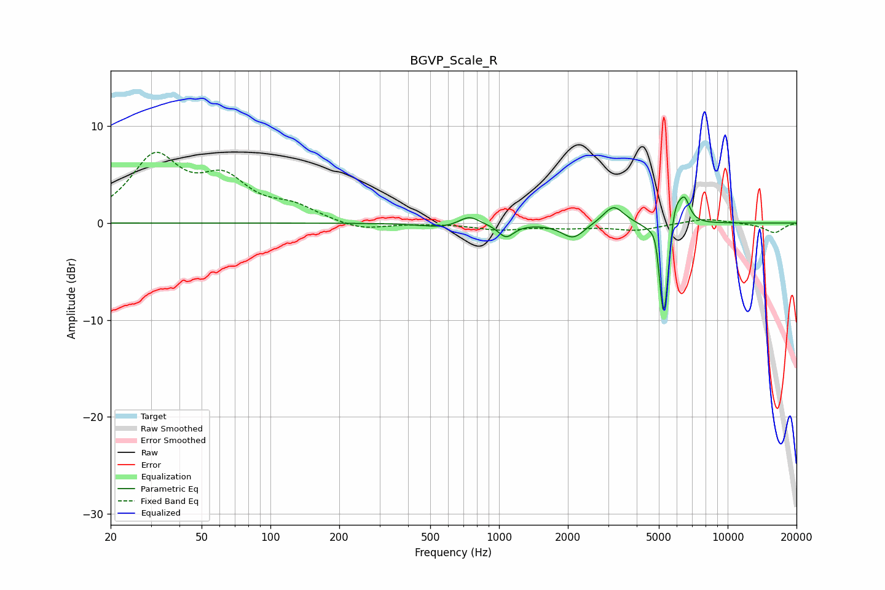

# BGVP_Scale_R
See [usage instructions](https://github.com/jaakkopasanen/AutoEq#usage) for more options and info.

### Parametric EQs
Apply preamp of -2.8 dB when using parametric equalizer.

|   # | Type    |   Fc (Hz) |    Q |   Gain (dB) |
|-----|---------|-----------|------|-------------|
|   1 | Peaking |       569 | 1.57 |        -0.5 |
|   2 | Peaking |       740 | 3.22 |         1   |
|   3 | Peaking |      1073 | 4.09 |        -1.4 |
|   4 | Peaking |      2110 | 2.84 |        -1.6 |
|   5 | Peaking |      3170 | 3.09 |         1.9 |
|   6 | Peaking |      4911 | 6    |         2.9 |
|   7 | Peaking |      5242 | 5.93 |        -9.6 |
|   8 | Peaking |      5244 | 5.98 |        -3.2 |
|   9 | Peaking |      5847 | 4.64 |         3.9 |
|  10 | Peaking |      6483 | 6    |         2.2 |

### Fixed Band EQs
When using fixed band (also called graphic) equalizer, apply preamp of **-7.4 dB** (if available) and set gains manually with these parameters.

|   # | Type    |   Fc (Hz) |    Q |   Gain (dB) |
|-----|---------|-----------|------|-------------|
|   1 | Peaking |        31 | 1.41 |         6.5 |
|   2 | Peaking |        62 | 1.41 |         3.9 |
|   3 | Peaking |       125 | 1.41 |         1.4 |
|   4 | Peaking |       250 | 1.41 |        -0.8 |
|   5 | Peaking |       500 | 1.41 |        -0   |
|   6 | Peaking |      1000 | 1.41 |        -0.6 |
|   7 | Peaking |      2000 | 1.41 |        -0.4 |
|   8 | Peaking |      4000 | 1.41 |        -0.7 |
|   9 | Peaking |      8000 | 1.41 |         0.5 |
|  10 | Peaking |     16000 | 1.41 |        -1   |

### Graphs

