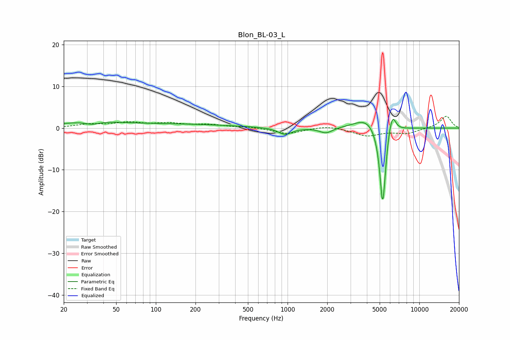

# Blon_BL-03_L
See [usage instructions](https://github.com/jaakkopasanen/AutoEq#usage) for more options and info.

### Parametric EQs
Apply preamp of -2.2 dB when using parametric equalizer.

|   # | Type    |   Fc (Hz) |    Q |   Gain (dB) |
|-----|---------|-----------|------|-------------|
|   1 | Peaking |        32 | 0.98 |         1.2 |
|   2 | Peaking |        33 | 2.16 |        -1.1 |
|   3 | Peaking |        81 | 0.2  |         1   |
|   4 | Peaking |       956 | 2.7  |        -1.6 |
|   5 | Peaking |      1959 | 2.84 |        -1.3 |
|   6 | Peaking |      4037 | 1.52 |         2.8 |
|   7 | Peaking |      5264 | 5.82 |       -16.4 |
|   8 | Peaking |      5317 | 6    |        -4.3 |
|   9 | Peaking |      5956 | 4.41 |         2.5 |
|  10 | Peaking |      6282 | 5.65 |         3.3 |

### Fixed Band EQs
When using fixed band (also called graphic) equalizer, apply preamp of **-2.9 dB** (if available) and set gains manually with these parameters.

|   # | Type    |   Fc (Hz) |    Q |   Gain (dB) |
|-----|---------|-----------|------|-------------|
|   1 | Peaking |        31 | 1.41 |         0.8 |
|   2 | Peaking |        62 | 1.41 |         1.2 |
|   3 | Peaking |       125 | 1.41 |         1   |
|   4 | Peaking |       250 | 1.41 |         0.7 |
|   5 | Peaking |       500 | 1.41 |         0.3 |
|   6 | Peaking |      1000 | 1.41 |        -1.4 |
|   7 | Peaking |      2000 | 1.41 |         0.7 |
|   8 | Peaking |      4000 | 1.41 |        -1.8 |
|   9 | Peaking |      8000 | 1.41 |        -1.2 |
|  10 | Peaking |     16000 | 1.41 |         2.9 |

### Graphs

