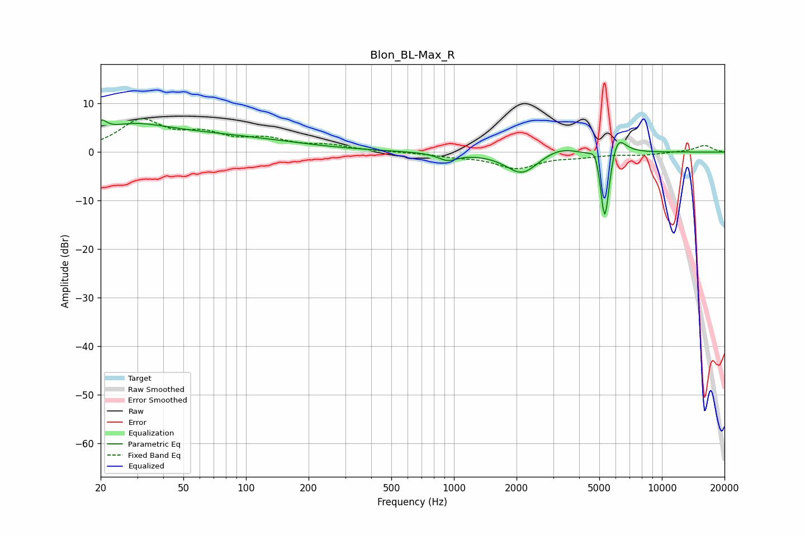

# Blon_BL-Max_R
See [usage instructions](https://github.com/jaakkopasanen/AutoEq#usage) for more options and info.

### Parametric EQs
Apply preamp of -6.7 dB when using parametric equalizer.

|   # | Type    |   Fc (Hz) |    Q |   Gain (dB) |
|-----|---------|-----------|------|-------------|
|   1 | Peaking |        20 | 5.9  |         2.2 |
|   2 | Peaking |        28 | 0.83 |         3.5 |
|   3 | Peaking |        63 | 0.35 |         3.2 |
|   4 | Peaking |       932 | 3.01 |        -1.5 |
|   5 | Peaking |      2128 | 1.82 |        -4.6 |
|   6 | Peaking |      3232 | 1.56 |         1.6 |
|   7 | Peaking |      4814 | 5.69 |         3.4 |
|   8 | Peaking |      5308 | 6    |       -12.8 |
|   9 | Peaking |      5326 | 6    |        -4   |
|  10 | Peaking |      6071 | 3.56 |         5.1 |

### Fixed Band EQs
When using fixed band (also called graphic) equalizer, apply preamp of **-7.0 dB** (if available) and set gains manually with these parameters.

|   # | Type    |   Fc (Hz) |    Q |   Gain (dB) |
|-----|---------|-----------|------|-------------|
|   1 | Peaking |        31 | 1.41 |         6.2 |
|   2 | Peaking |        62 | 1.41 |         3   |
|   3 | Peaking |       125 | 1.41 |         2.3 |
|   4 | Peaking |       250 | 1.41 |         1.1 |
|   5 | Peaking |       500 | 1.41 |         0   |
|   6 | Peaking |      1000 | 1.41 |        -0.7 |
|   7 | Peaking |      2000 | 1.41 |        -3.2 |
|   8 | Peaking |      4000 | 1.41 |        -0.7 |
|   9 | Peaking |      8000 | 1.41 |        -0.5 |
|  10 | Peaking |     16000 | 1.41 |         1.4 |

### Graphs

