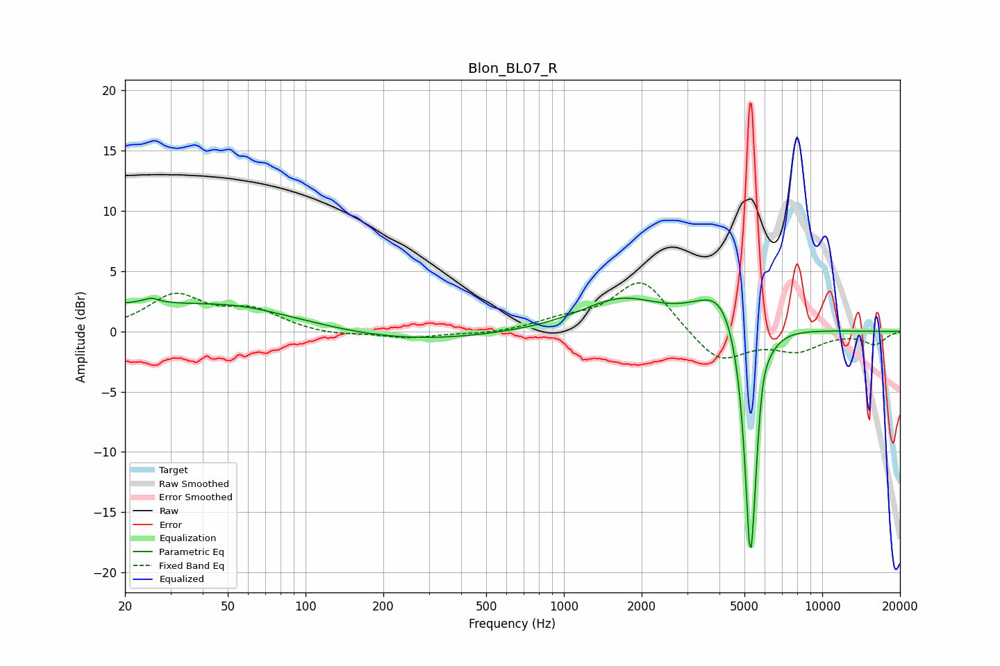

# Blon_BL07_R
See [usage instructions](https://github.com/jaakkopasanen/AutoEq#usage) for more options and info.

### Parametric EQs
Apply preamp of -2.9 dB when using parametric equalizer.

|   # | Type    |   Fc (Hz) |    Q |   Gain (dB) |
|-----|---------|-----------|------|-------------|
|   1 | Peaking |        21 | 0.18 |         2.3 |
|   2 | Peaking |        25 | 5.98 |        -2   |
|   3 | Peaking |        25 | 5.72 |         2.4 |
|   4 | Peaking |        57 | 0.93 |         0.4 |
|   5 | Peaking |       219 | 0.42 |        -1   |
|   6 | Peaking |      1656 | 0.9  |         2.6 |
|   7 | Peaking |      4155 | 1.41 |         3.9 |
|   8 | Peaking |      5260 | 5.72 |       -17.9 |
|   9 | Peaking |      5401 | 6    |        -4.4 |
|  10 | Peaking |      5829 | 6    |         1.9 |

### Fixed Band EQs
When using fixed band (also called graphic) equalizer, apply preamp of **-4.1 dB** (if available) and set gains manually with these parameters.

|   # | Type    |   Fc (Hz) |    Q |   Gain (dB) |
|-----|---------|-----------|------|-------------|
|   1 | Peaking |        31 | 1.41 |         2.9 |
|   2 | Peaking |        62 | 1.41 |         1.6 |
|   3 | Peaking |       125 | 1.41 |        -0.3 |
|   4 | Peaking |       250 | 1.41 |        -0.5 |
|   5 | Peaking |       500 | 1.41 |        -0.2 |
|   6 | Peaking |      1000 | 1.41 |         0.8 |
|   7 | Peaking |      2000 | 1.41 |         4.4 |
|   8 | Peaking |      4000 | 1.41 |        -2.7 |
|   9 | Peaking |      8000 | 1.41 |        -1.5 |
|  10 | Peaking |     16000 | 1.41 |        -1   |

### Graphs

