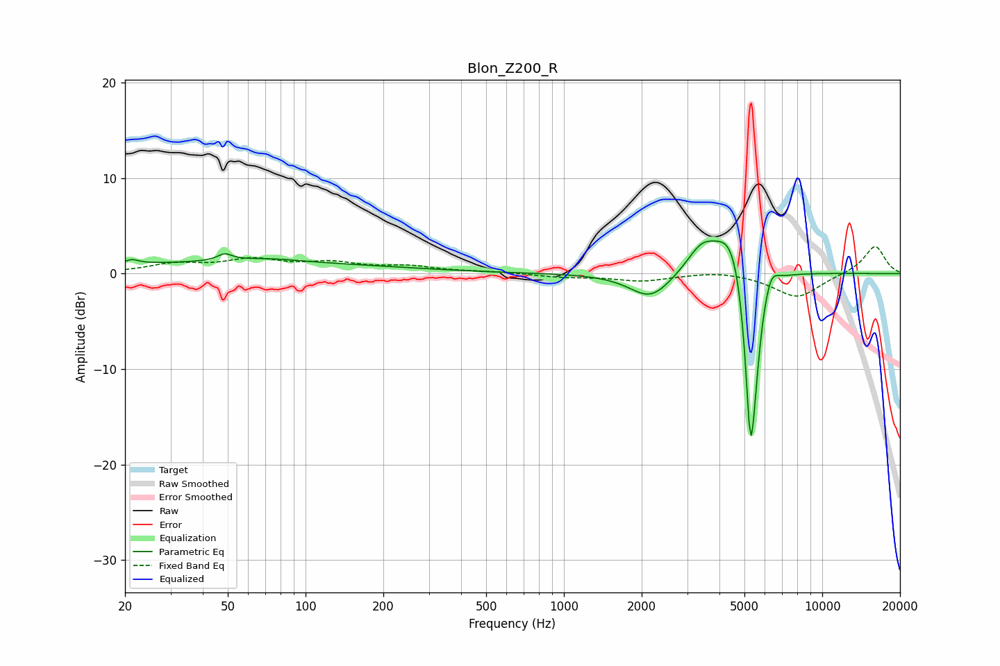

# Blon_Z200_R
See [usage instructions](https://github.com/jaakkopasanen/AutoEq#usage) for more options and info.

### Parametric EQs
Apply preamp of -3.5 dB when using parametric equalizer.

|   # | Type    |   Fc (Hz) |    Q |   Gain (dB) |
|-----|---------|-----------|------|-------------|
|   1 | Peaking |        21 | 5.61 |         0.4 |
|   2 | Peaking |        48 | 0.18 |         1.1 |
|   3 | Peaking |        49 | 5.06 |         0.7 |
|   4 | Peaking |        71 | 1.08 |         0.4 |
|   5 | Peaking |      2169 | 1.73 |        -2.8 |
|   6 | Peaking |      3411 | 2.43 |         2.5 |
|   7 | Peaking |      4536 | 2.08 |         5.9 |
|   8 | Peaking |      5269 | 5.85 |       -17.1 |
|   9 | Peaking |      5439 | 6    |        -5.2 |
|  10 | Peaking |      6334 | 5.34 |         1.8 |

### Fixed Band EQs
When using fixed band (also called graphic) equalizer, apply preamp of **-2.9 dB** (if available) and set gains manually with these parameters.

|   # | Type    |   Fc (Hz) |    Q |   Gain (dB) |
|-----|---------|-----------|------|-------------|
|   1 | Peaking |        31 | 1.41 |         0.9 |
|   2 | Peaking |        62 | 1.41 |         1.3 |
|   3 | Peaking |       125 | 1.41 |         1   |
|   4 | Peaking |       250 | 1.41 |         0.7 |
|   5 | Peaking |       500 | 1.41 |         0.2 |
|   6 | Peaking |      1000 | 1.41 |        -0.3 |
|   7 | Peaking |      2000 | 1.41 |        -0.7 |
|   8 | Peaking |      4000 | 1.41 |         0.3 |
|   9 | Peaking |      8000 | 1.41 |        -2.5 |
|  10 | Peaking |     16000 | 1.41 |         3   |

### Graphs

