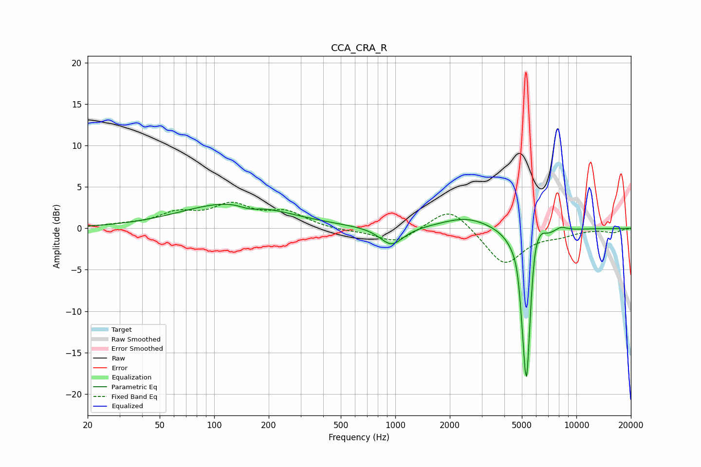

# CCA_CRA_R
See [usage instructions](https://github.com/jaakkopasanen/AutoEq#usage) for more options and info.

### Parametric EQs
Apply preamp of -3.0 dB when using parametric equalizer.

|   # | Type    |   Fc (Hz) |    Q |   Gain (dB) |
|-----|---------|-----------|------|-------------|
|   1 | Peaking |       127 | 0.51 |         3.1 |
|   2 | Peaking |       156 | 2.59 |        -0.6 |
|   3 | Peaking |       953 | 2.21 |        -2.3 |
|   4 | Peaking |      2474 | 1.03 |         1.4 |
|   5 | Peaking |      4760 | 6    |         1.5 |
|   6 | Peaking |      5131 | 6    |        -3.8 |
|   7 | Peaking |      5312 | 5.7  |       -17.3 |
|   8 | Peaking |      5870 | 5.57 |         3.2 |
|   9 | Peaking |      6394 | 5.04 |         1.3 |
|  10 | Peaking |      8190 | 3.67 |         0.6 |

### Fixed Band EQs
When using fixed band (also called graphic) equalizer, apply preamp of **-3.3 dB** (if available) and set gains manually with these parameters.

|   # | Type    |   Fc (Hz) |    Q |   Gain (dB) |
|-----|---------|-----------|------|-------------|
|   1 | Peaking |        31 | 1.41 |         0.3 |
|   2 | Peaking |        62 | 1.41 |         1.6 |
|   3 | Peaking |       125 | 1.41 |         2.5 |
|   4 | Peaking |       250 | 1.41 |         1.8 |
|   5 | Peaking |       500 | 1.41 |        -0.3 |
|   6 | Peaking |      1000 | 1.41 |        -1.8 |
|   7 | Peaking |      2000 | 1.41 |         2.8 |
|   8 | Peaking |      4000 | 1.41 |        -4.4 |
|   9 | Peaking |      8000 | 1.41 |        -0.7 |
|  10 | Peaking |     16000 | 1.41 |        -0.5 |

### Graphs

