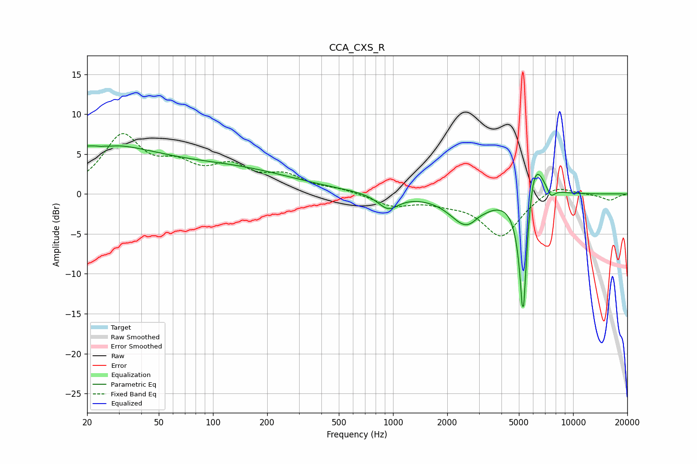

# CCA_CXS_R
See [usage instructions](https://github.com/jaakkopasanen/AutoEq#usage) for more options and info.

### Parametric EQs
Apply preamp of -6.1 dB when using parametric equalizer.

|   # | Type    |   Fc (Hz) |    Q |   Gain (dB) |
|-----|---------|-----------|------|-------------|
|   1 | Peaking |        23 | 0.4  |         5.8 |
|   2 | Peaking |        25 | 5.41 |        -3.5 |
|   3 | Peaking |        25 | 5.74 |         3.3 |
|   4 | Peaking |       137 | 0.42 |         2.6 |
|   5 | Peaking |       940 | 2.45 |        -1.9 |
|   6 | Peaking |      2547 | 1.6  |        -3.8 |
|   7 | Peaking |      2986 | 5.74 |         0.2 |
|   8 | Peaking |      5281 | 6    |       -18.5 |
|   9 | Peaking |      6031 | 2.66 |         7.3 |
|  10 | Peaking |      7512 | 5.95 |        -1.2 |

### Fixed Band EQs
When using fixed band (also called graphic) equalizer, apply preamp of **-7.7 dB** (if available) and set gains manually with these parameters.

|   # | Type    |   Fc (Hz) |    Q |   Gain (dB) |
|-----|---------|-----------|------|-------------|
|   1 | Peaking |        31 | 1.41 |         6.9 |
|   2 | Peaking |        62 | 1.41 |         2.8 |
|   3 | Peaking |       125 | 1.41 |         2.9 |
|   4 | Peaking |       250 | 1.41 |         2   |
|   5 | Peaking |       500 | 1.41 |         0.5 |
|   6 | Peaking |      1000 | 1.41 |        -1.4 |
|   7 | Peaking |      2000 | 1.41 |        -0.7 |
|   8 | Peaking |      4000 | 1.41 |        -5.3 |
|   9 | Peaking |      8000 | 1.41 |         1.4 |
|  10 | Peaking |     16000 | 1.41 |        -0.8 |

### Graphs

