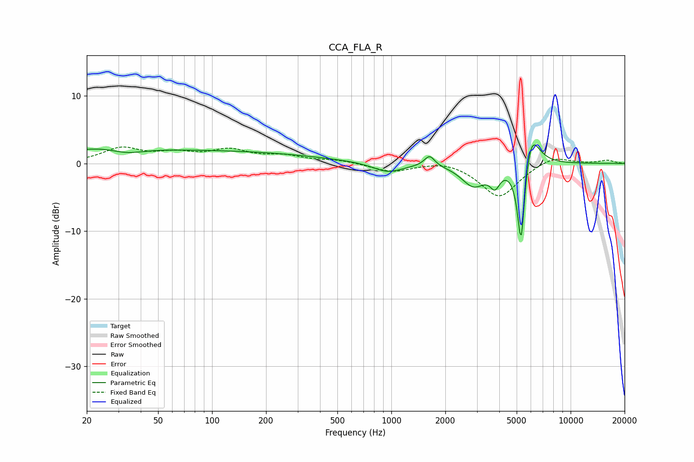

# CCA_FLA_R
See [usage instructions](https://github.com/jaakkopasanen/AutoEq#usage) for more options and info.

### Parametric EQs
Apply preamp of -2.8 dB when using parametric equalizer.

|   # | Type    |   Fc (Hz) |    Q |   Gain (dB) |
|-----|---------|-----------|------|-------------|
|   1 | Peaking |        24 | 0.61 |         2   |
|   2 | Peaking |        33 | 1.39 |        -1   |
|   3 | Peaking |       115 | 0.27 |         1.7 |
|   4 | Peaking |       956 | 1.69 |        -1.4 |
|   5 | Peaking |      1634 | 4.91 |         1.6 |
|   6 | Peaking |      2446 | 0.4  |         0   |
|   7 | Peaking |      2875 | 2.11 |        -3.3 |
|   8 | Peaking |      3785 | 5.2  |        -2.4 |
|   9 | Peaking |      5297 | 6    |       -14.3 |
|  10 | Peaking |      5963 | 2.97 |         6.6 |

### Fixed Band EQs
When using fixed band (also called graphic) equalizer, apply preamp of **-2.5 dB** (if available) and set gains manually with these parameters.

|   # | Type    |   Fc (Hz) |    Q |   Gain (dB) |
|-----|---------|-----------|------|-------------|
|   1 | Peaking |        31 | 1.41 |         2.1 |
|   2 | Peaking |        62 | 1.41 |         1.3 |
|   3 | Peaking |       125 | 1.41 |         1.8 |
|   4 | Peaking |       250 | 1.41 |         1   |
|   5 | Peaking |       500 | 1.41 |         0.5 |
|   6 | Peaking |      1000 | 1.41 |        -1.2 |
|   7 | Peaking |      2000 | 1.41 |         0.6 |
|   8 | Peaking |      4000 | 1.41 |        -5   |
|   9 | Peaking |      8000 | 1.41 |         1.2 |
|  10 | Peaking |     16000 | 1.41 |         0.5 |

### Graphs

