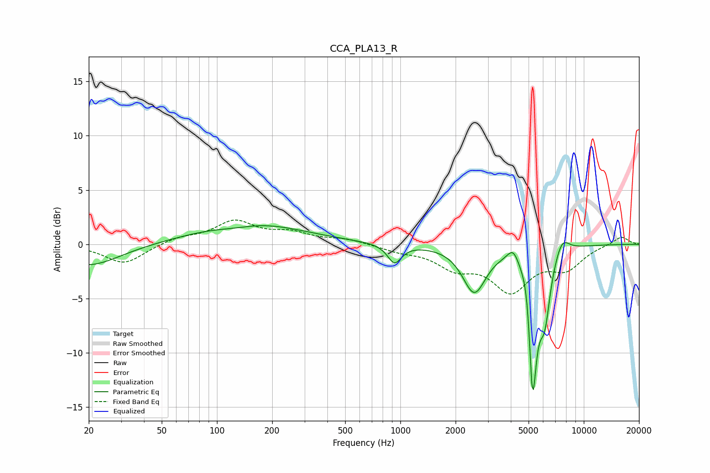

# CCA_PLA13_R
See [usage instructions](https://github.com/jaakkopasanen/AutoEq#usage) for more options and info.

### Parametric EQs
Apply preamp of -1.8 dB when using parametric equalizer.

|   # | Type    |   Fc (Hz) |    Q |   Gain (dB) |
|-----|---------|-----------|------|-------------|
|   1 | Peaking |        20 | 0.83 |        -2   |
|   2 | Peaking |       125 | 1.21 |        -0.4 |
|   3 | Peaking |       149 | 0.49 |         2.1 |
|   4 | Peaking |       929 | 3.78 |        -1.7 |
|   5 | Peaking |      2529 | 2.25 |        -4.3 |
|   6 | Peaking |      4130 | 4.33 |         1.4 |
|   7 | Peaking |      4980 | 4.92 |         3.9 |
|   8 | Peaking |      5251 | 5.54 |       -15   |
|   9 | Peaking |      6126 | 4.61 |        -5.1 |
|  10 | Peaking |      7616 | 3.47 |         1.5 |

### Fixed Band EQs
When using fixed band (also called graphic) equalizer, apply preamp of **-2.3 dB** (if available) and set gains manually with these parameters.

|   # | Type    |   Fc (Hz) |    Q |   Gain (dB) |
|-----|---------|-----------|------|-------------|
|   1 | Peaking |        31 | 1.41 |        -1.8 |
|   2 | Peaking |        62 | 1.41 |         0.6 |
|   3 | Peaking |       125 | 1.41 |         2   |
|   4 | Peaking |       250 | 1.41 |         0.9 |
|   5 | Peaking |       500 | 1.41 |         0.5 |
|   6 | Peaking |      1000 | 1.41 |        -0.5 |
|   7 | Peaking |      2000 | 1.41 |        -1.9 |
|   8 | Peaking |      4000 | 1.41 |        -4   |
|   9 | Peaking |      8000 | 1.41 |        -2   |
|  10 | Peaking |     16000 | 1.41 |         0.8 |

### Graphs

