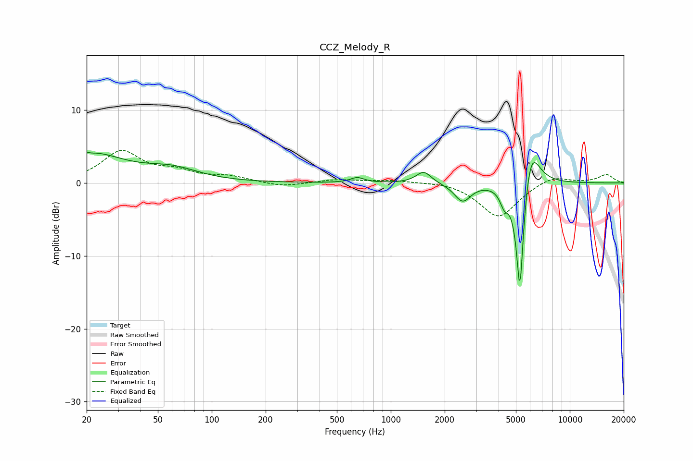

# CCZ_Melody_R
See [usage instructions](https://github.com/jaakkopasanen/AutoEq#usage) for more options and info.

### Parametric EQs
Apply preamp of -4.3 dB when using parametric equalizer.

|   # | Type    |   Fc (Hz) |    Q |   Gain (dB) |
|-----|---------|-----------|------|-------------|
|   1 | Peaking |        20 | 0.72 |         4   |
|   2 | Peaking |        20 | 6    |         2.1 |
|   3 | Peaking |        20 | 5.98 |        -2.1 |
|   4 | Peaking |        60 | 0.97 |         1.6 |
|   5 | Peaking |       650 | 3.84 |         0.7 |
|   6 | Peaking |      1528 | 3.37 |         1.7 |
|   7 | Peaking |      2518 | 3.1  |        -2.5 |
|   8 | Peaking |      4303 | 6    |        -2   |
|   9 | Peaking |      5265 | 6    |       -17.4 |
|  10 | Peaking |      6023 | 2.82 |         6.9 |

### Fixed Band EQs
When using fixed band (also called graphic) equalizer, apply preamp of **-4.6 dB** (if available) and set gains manually with these parameters.

|   # | Type    |   Fc (Hz) |    Q |   Gain (dB) |
|-----|---------|-----------|------|-------------|
|   1 | Peaking |        31 | 1.41 |         4.2 |
|   2 | Peaking |        62 | 1.41 |         1.3 |
|   3 | Peaking |       125 | 1.41 |         0.8 |
|   4 | Peaking |       250 | 1.41 |        -0.6 |
|   5 | Peaking |       500 | 1.41 |         0.5 |
|   6 | Peaking |      1000 | 1.41 |         0.4 |
|   7 | Peaking |      2000 | 1.41 |         0.3 |
|   8 | Peaking |      4000 | 1.41 |        -4.7 |
|   9 | Peaking |      8000 | 1.41 |         1.1 |
|  10 | Peaking |     16000 | 1.41 |         1.1 |

### Graphs

