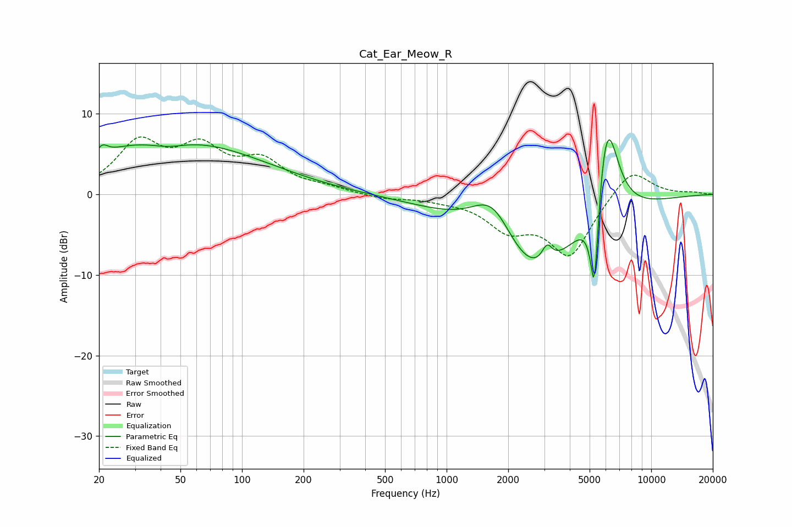

# Cat_Ear_Meow_R
See [usage instructions](https://github.com/jaakkopasanen/AutoEq#usage) for more options and info.

### Parametric EQs
Apply preamp of -6.9 dB when using parametric equalizer.

|   # | Type    |   Fc (Hz) |    Q |   Gain (dB) |
|-----|---------|-----------|------|-------------|
|   1 | Peaking |        20 | 2.98 |        -1   |
|   2 | Peaking |        21 | 4.89 |         1.7 |
|   3 | Peaking |        43 | 1.45 |        -1.1 |
|   4 | Peaking |        44 | 0.31 |         7   |
|   5 | Peaking |      1687 | 1.25 |         6.8 |
|   6 | Peaking |      2567 | 0.6  |       -11.6 |
|   7 | Peaking |      3097 | 5.62 |         2.1 |
|   8 | Peaking |      5277 | 6    |       -13.9 |
|   9 | Peaking |      5930 | 2.71 |         6.8 |
|  10 | Peaking |      6136 | 2.39 |         7.6 |

### Fixed Band EQs
When using fixed band (also called graphic) equalizer, apply preamp of **-7.2 dB** (if available) and set gains manually with these parameters.

|   # | Type    |   Fc (Hz) |    Q |   Gain (dB) |
|-----|---------|-----------|------|-------------|
|   1 | Peaking |        31 | 1.41 |         6   |
|   2 | Peaking |        62 | 1.41 |         5   |
|   3 | Peaking |       125 | 1.41 |         3.6 |
|   4 | Peaking |       250 | 1.41 |         0.6 |
|   5 | Peaking |       500 | 1.41 |        -0.5 |
|   6 | Peaking |      1000 | 1.41 |        -0.4 |
|   7 | Peaking |      2000 | 1.41 |        -3.8 |
|   8 | Peaking |      4000 | 1.41 |        -7.4 |
|   9 | Peaking |      8000 | 1.41 |         3.5 |
|  10 | Peaking |     16000 | 1.41 |         0.2 |

### Graphs

