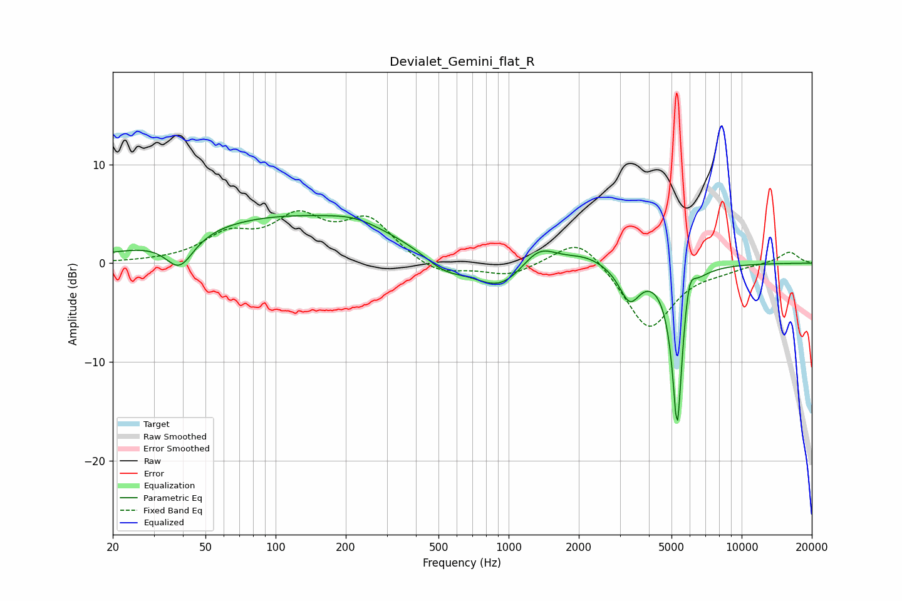

# Devialet_Gemini_flat_R
See [usage instructions](https://github.com/jaakkopasanen/AutoEq#usage) for more options and info.

### Parametric EQs
Apply preamp of -4.9 dB when using parametric equalizer.

|   # | Type    |   Fc (Hz) |    Q |   Gain (dB) |
|-----|---------|-----------|------|-------------|
|   1 | Peaking |        39 | 2.37 |        -3.2 |
|   2 | Peaking |       111 | 0.29 |         4.7 |
|   3 | Peaking |       221 | 1.25 |         0.8 |
|   4 | Peaking |       527 | 1.6  |        -1.6 |
|   5 | Peaking |       919 | 1.21 |        -3.1 |
|   6 | Peaking |      1345 | 1.85 |         2.4 |
|   7 | Peaking |      2138 | 1.61 |         0.9 |
|   8 | Peaking |      3306 | 3.16 |        -3.5 |
|   9 | Peaking |      5293 | 6    |       -17   |
|  10 | Peaking |      5943 | 5.84 |         3.2 |

### Fixed Band EQs
When using fixed band (also called graphic) equalizer, apply preamp of **-5.4 dB** (if available) and set gains manually with these parameters.

|   # | Type    |   Fc (Hz) |    Q |   Gain (dB) |
|-----|---------|-----------|------|-------------|
|   1 | Peaking |        31 | 1.41 |         0.1 |
|   2 | Peaking |        62 | 1.41 |         2.5 |
|   3 | Peaking |       125 | 1.41 |         4.1 |
|   4 | Peaking |       250 | 1.41 |         4.1 |
|   5 | Peaking |       500 | 1.41 |        -1.3 |
|   6 | Peaking |      1000 | 1.41 |        -1.3 |
|   7 | Peaking |      2000 | 1.41 |         3   |
|   8 | Peaking |      4000 | 1.41 |        -6.8 |
|   9 | Peaking |      8000 | 1.41 |        -0.5 |
|  10 | Peaking |     16000 | 1.41 |         1.2 |

### Graphs

