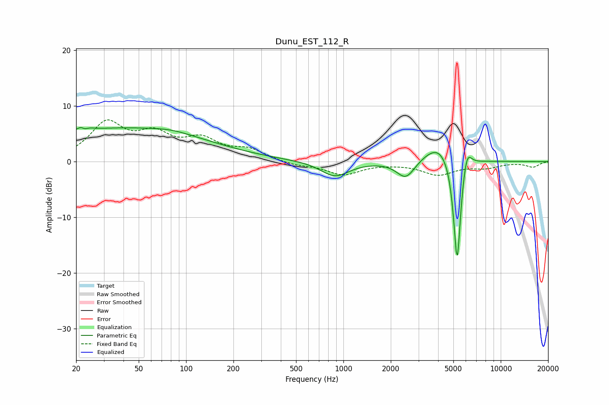

# Dunu_EST_112_R
See [usage instructions](https://github.com/jaakkopasanen/AutoEq#usage) for more options and info.

### Parametric EQs
Apply preamp of -6.2 dB when using parametric equalizer.

|   # | Type    |   Fc (Hz) |    Q |   Gain (dB) |
|-----|---------|-----------|------|-------------|
|   1 | Peaking |        22 | 4.91 |         3.7 |
|   2 | Peaking |        23 | 5.77 |        -3.3 |
|   3 | Peaking |        39 | 0.24 |         5.9 |
|   4 | Peaking |        81 | 1.21 |         0.5 |
|   5 | Peaking |       884 | 1.59 |        -2.7 |
|   6 | Peaking |      2496 | 2.39 |        -3.4 |
|   7 | Peaking |      4104 | 1.42 |         3.8 |
|   8 | Peaking |      5226 | 6    |        -4.3 |
|   9 | Peaking |      5294 | 6    |       -16.2 |
|  10 | Peaking |      6091 | 4.93 |         3.9 |

### Fixed Band EQs
When using fixed band (also called graphic) equalizer, apply preamp of **-7.6 dB** (if available) and set gains manually with these parameters.

|   # | Type    |   Fc (Hz) |    Q |   Gain (dB) |
|-----|---------|-----------|------|-------------|
|   1 | Peaking |        31 | 1.41 |         6.6 |
|   2 | Peaking |        62 | 1.41 |         4.1 |
|   3 | Peaking |       125 | 1.41 |         3.4 |
|   4 | Peaking |       250 | 1.41 |         1.9 |
|   5 | Peaking |       500 | 1.41 |        -0.6 |
|   6 | Peaking |      1000 | 1.41 |        -2.3 |
|   7 | Peaking |      2000 | 1.41 |        -0.1 |
|   8 | Peaking |      4000 | 1.41 |        -2.2 |
|   9 | Peaking |      8000 | 1.41 |        -0.9 |
|  10 | Peaking |     16000 | 1.41 |        -0.9 |

### Graphs

