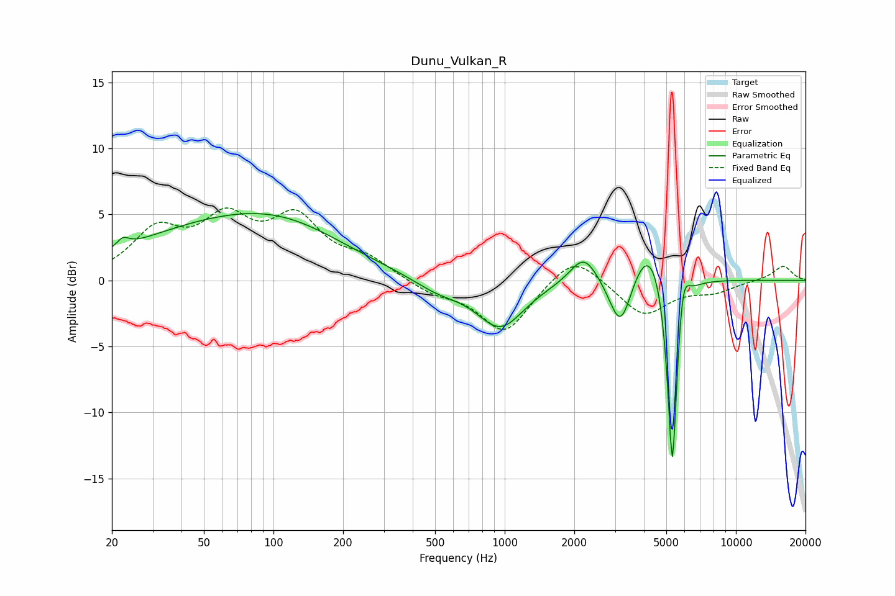

# Dunu_Vulkan_R
See [usage instructions](https://github.com/jaakkopasanen/AutoEq#usage) for more options and info.

### Parametric EQs
Apply preamp of -5.2 dB when using parametric equalizer.

|   # | Type    |   Fc (Hz) |    Q |   Gain (dB) |
|-----|---------|-----------|------|-------------|
|   1 | Peaking |        22 | 5.48 |         0.7 |
|   2 | Peaking |        61 | 0.34 |         4   |
|   3 | Peaking |       117 | 0.57 |         1.5 |
|   4 | Peaking |       513 | 1.28 |        -0.9 |
|   5 | Peaking |       957 | 1.39 |        -3.6 |
|   6 | Peaking |      2199 | 2.39 |         2.2 |
|   7 | Peaking |      3173 | 2.87 |        -4.4 |
|   8 | Peaking |      4320 | 1.72 |         4.4 |
|   9 | Peaking |      5312 | 6    |       -17.2 |
|  10 | Peaking |      5892 | 5.52 |         3.4 |

### Fixed Band EQs
When using fixed band (also called graphic) equalizer, apply preamp of **-5.6 dB** (if available) and set gains manually with these parameters.

|   # | Type    |   Fc (Hz) |    Q |   Gain (dB) |
|-----|---------|-----------|------|-------------|
|   1 | Peaking |        31 | 1.41 |         3.4 |
|   2 | Peaking |        62 | 1.41 |         4   |
|   3 | Peaking |       125 | 1.41 |         4.3 |
|   4 | Peaking |       250 | 1.41 |         1.4 |
|   5 | Peaking |       500 | 1.41 |        -0.9 |
|   6 | Peaking |      1000 | 1.41 |        -3.9 |
|   7 | Peaking |      2000 | 1.41 |         2.2 |
|   8 | Peaking |      4000 | 1.41 |        -2.6 |
|   9 | Peaking |      8000 | 1.41 |        -0.7 |
|  10 | Peaking |     16000 | 1.41 |         1.1 |

### Graphs

