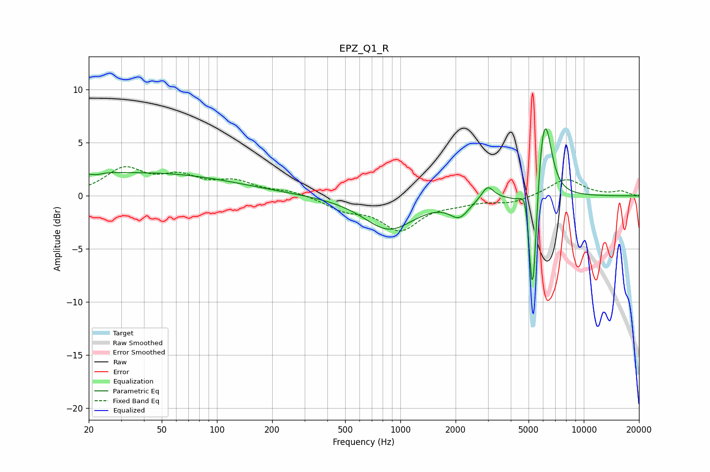

# EPZ_Q1_R
See [usage instructions](https://github.com/jaakkopasanen/AutoEq#usage) for more options and info.

### Parametric EQs
Apply preamp of -6.4 dB when using parametric equalizer.

|   # | Type    |   Fc (Hz) |    Q |   Gain (dB) |
|-----|---------|-----------|------|-------------|
|   1 | Peaking |        20 | 1.3  |         0.7 |
|   2 | Peaking |        22 | 4.46 |        -0.3 |
|   3 | Peaking |        45 | 0.32 |         2.1 |
|   4 | Peaking |       867 | 1.03 |        -3.1 |
|   5 | Peaking |      2096 | 2.7  |        -1.6 |
|   6 | Peaking |      2990 | 4.21 |         1.3 |
|   7 | Peaking |      4798 | 6    |         2.5 |
|   8 | Peaking |      5264 | 6    |       -12.8 |
|   9 | Peaking |      5904 | 4.2  |         4.6 |
|  10 | Peaking |      6233 | 3.86 |         5   |

### Fixed Band EQs
When using fixed band (also called graphic) equalizer, apply preamp of **-2.8 dB** (if available) and set gains manually with these parameters.

|   # | Type    |   Fc (Hz) |    Q |   Gain (dB) |
|-----|---------|-----------|------|-------------|
|   1 | Peaking |        31 | 1.41 |         2.4 |
|   2 | Peaking |        62 | 1.41 |         1.6 |
|   3 | Peaking |       125 | 1.41 |         1.2 |
|   4 | Peaking |       250 | 1.41 |         0.4 |
|   5 | Peaking |       500 | 1.41 |        -1.1 |
|   6 | Peaking |      1000 | 1.41 |        -3   |
|   7 | Peaking |      2000 | 1.41 |        -0.5 |
|   8 | Peaking |      4000 | 1.41 |        -0.6 |
|   9 | Peaking |      8000 | 1.41 |         1.6 |
|  10 | Peaking |     16000 | 1.41 |         0.4 |

### Graphs

