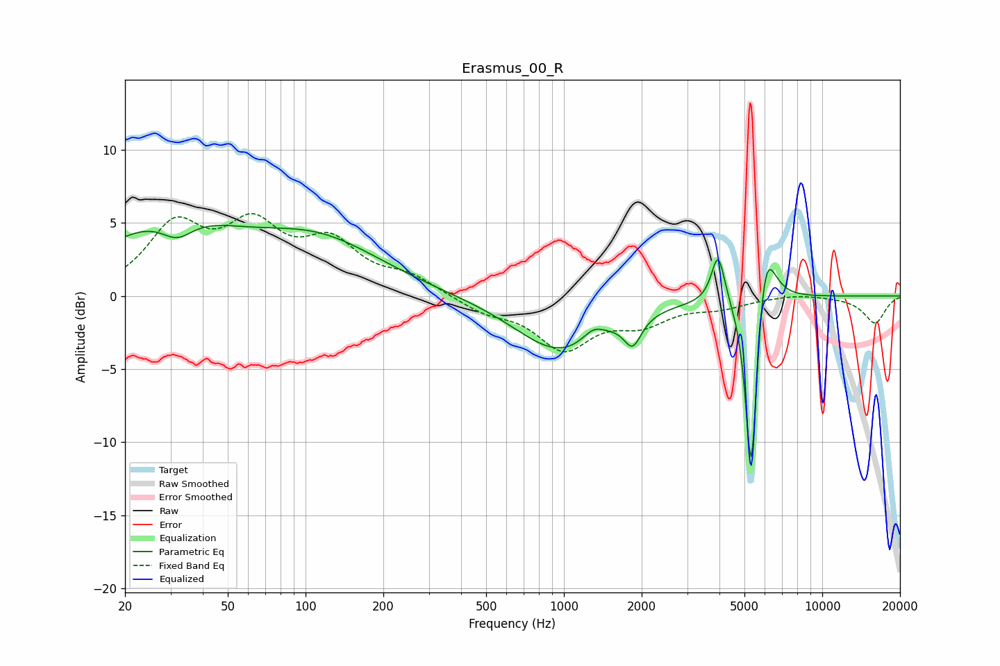

# Erasmus_00_R
See [usage instructions](https://github.com/jaakkopasanen/AutoEq#usage) for more options and info.

### Parametric EQs
Apply preamp of -4.9 dB when using parametric equalizer.

|   # | Type    |   Fc (Hz) |    Q |   Gain (dB) |
|-----|---------|-----------|------|-------------|
|   1 | Peaking |        29 | 0.55 |         4.8 |
|   2 | Peaking |        32 | 2.24 |        -1.5 |
|   3 | Peaking |       113 | 0.57 |         3.4 |
|   4 | Peaking |       968 | 0.81 |        -3.8 |
|   5 | Peaking |      1301 | 3.37 |         0.8 |
|   6 | Peaking |      1846 | 4.25 |        -1.9 |
|   7 | Peaking |      3954 | 5.49 |         3.4 |
|   8 | Peaking |      5313 | 6    |       -11.2 |
|   9 | Peaking |      5325 | 6    |        -2.4 |
|  10 | Peaking |      6012 | 3.61 |         4.9 |

### Fixed Band EQs
When using fixed band (also called graphic) equalizer, apply preamp of **-5.7 dB** (if available) and set gains manually with these parameters.

|   # | Type    |   Fc (Hz) |    Q |   Gain (dB) |
|-----|---------|-----------|------|-------------|
|   1 | Peaking |        31 | 1.41 |         4.5 |
|   2 | Peaking |        62 | 1.41 |         4.2 |
|   3 | Peaking |       125 | 1.41 |         3.2 |
|   4 | Peaking |       250 | 1.41 |         1.2 |
|   5 | Peaking |       500 | 1.41 |        -1   |
|   6 | Peaking |      1000 | 1.41 |        -3.4 |
|   7 | Peaking |      2000 | 1.41 |        -1.6 |
|   8 | Peaking |      4000 | 1.41 |        -0.6 |
|   9 | Peaking |      8000 | 1.41 |         0.2 |
|  10 | Peaking |     16000 | 1.41 |        -1.9 |

### Graphs

