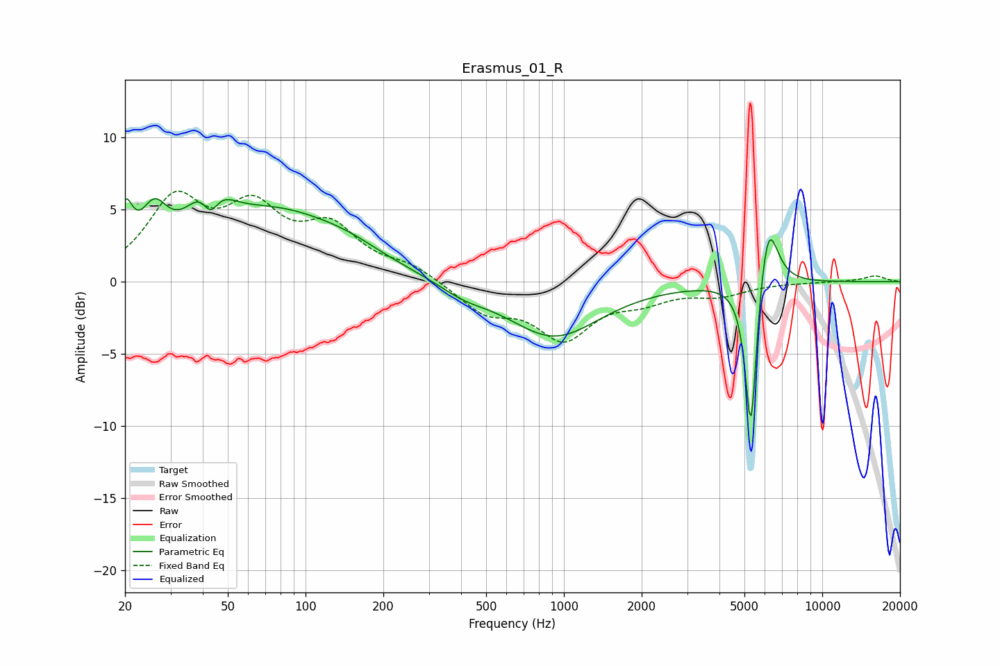

# Erasmus_01_R
See [usage instructions](https://github.com/jaakkopasanen/AutoEq#usage) for more options and info.

### Parametric EQs
Apply preamp of -5.8 dB when using parametric equalizer.

|   # | Type    |   Fc (Hz) |    Q |   Gain (dB) |
|-----|---------|-----------|------|-------------|
|   1 | Peaking |        20 | 5.2  |         3.4 |
|   2 | Peaking |        26 | 2.79 |         3.1 |
|   3 | Peaking |        42 | 2.25 |         4.8 |
|   4 | Peaking |        43 | 3.98 |        -3.4 |
|   5 | Peaking |        77 | 0.52 |         4.6 |
|   6 | Peaking |       147 | 1.16 |         0.5 |
|   7 | Peaking |       409 | 1.52 |        -0.7 |
|   8 | Peaking |       914 | 0.79 |        -3.8 |
|   9 | Peaking |      5296 | 6    |       -11.4 |
|  10 | Peaking |      6162 | 3.63 |         5.2 |

### Fixed Band EQs
When using fixed band (also called graphic) equalizer, apply preamp of **-6.4 dB** (if available) and set gains manually with these parameters.

|   # | Type    |   Fc (Hz) |    Q |   Gain (dB) |
|-----|---------|-----------|------|-------------|
|   1 | Peaking |        31 | 1.41 |         5.3 |
|   2 | Peaking |        62 | 1.41 |         4.4 |
|   3 | Peaking |       125 | 1.41 |         3.3 |
|   4 | Peaking |       250 | 1.41 |         1   |
|   5 | Peaking |       500 | 1.41 |        -2   |
|   6 | Peaking |      1000 | 1.41 |        -3.7 |
|   7 | Peaking |      2000 | 1.41 |        -1   |
|   8 | Peaking |      4000 | 1.41 |        -0.8 |
|   9 | Peaking |      8000 | 1.41 |        -0   |
|  10 | Peaking |     16000 | 1.41 |         0.4 |

### Graphs

