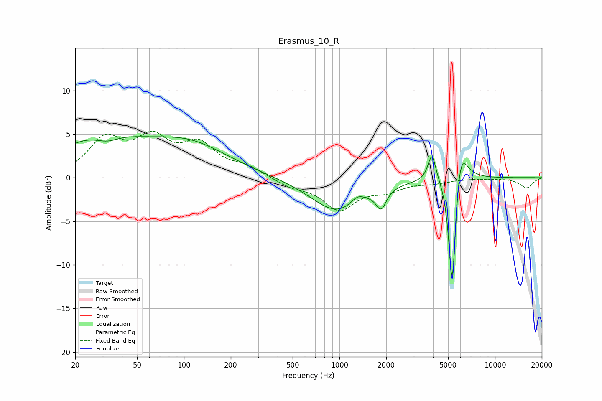

# Erasmus_10_R
See [usage instructions](https://github.com/jaakkopasanen/AutoEq#usage) for more options and info.

### Parametric EQs
Apply preamp of -4.8 dB when using parametric equalizer.

|   # | Type    |   Fc (Hz) |    Q |   Gain (dB) |
|-----|---------|-----------|------|-------------|
|   1 | Peaking |        28 | 0.53 |         4.4 |
|   2 | Peaking |        32 | 1.83 |        -1   |
|   3 | Peaking |       108 | 0.55 |         3.5 |
|   4 | Peaking |       964 | 0.84 |        -3.9 |
|   5 | Peaking |      1306 | 3.35 |         0.9 |
|   6 | Peaking |      1853 | 4.35 |        -2.2 |
|   7 | Peaking |      3933 | 5.53 |         3.2 |
|   8 | Peaking |      5314 | 6    |       -11.7 |
|   9 | Peaking |      5315 | 6    |        -3   |
|  10 | Peaking |      5930 | 3.14 |         5.1 |

### Fixed Band EQs
When using fixed band (also called graphic) equalizer, apply preamp of **-5.4 dB** (if available) and set gains manually with these parameters.

|   # | Type    |   Fc (Hz) |    Q |   Gain (dB) |
|-----|---------|-----------|------|-------------|
|   1 | Peaking |        31 | 1.41 |         4.1 |
|   2 | Peaking |        62 | 1.41 |         3.9 |
|   3 | Peaking |       125 | 1.41 |         3.4 |
|   4 | Peaking |       250 | 1.41 |         1.1 |
|   5 | Peaking |       500 | 1.41 |        -0.9 |
|   6 | Peaking |      1000 | 1.41 |        -3.5 |
|   7 | Peaking |      2000 | 1.41 |        -1.2 |
|   8 | Peaking |      4000 | 1.41 |        -0.5 |
|   9 | Peaking |      8000 | 1.41 |        -0   |
|  10 | Peaking |     16000 | 1.41 |        -1.2 |

### Graphs

