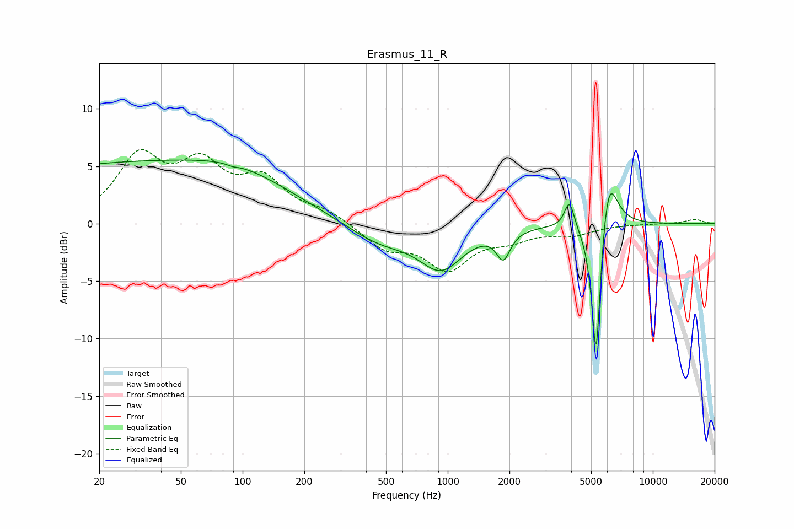

# Erasmus_11_R
See [usage instructions](https://github.com/jaakkopasanen/AutoEq#usage) for more options and info.

### Parametric EQs
Apply preamp of -5.6 dB when using parametric equalizer.

|   # | Type    |   Fc (Hz) |    Q |   Gain (dB) |
|-----|---------|-----------|------|-------------|
|   1 | Peaking |        28 | 0.18 |         5.2 |
|   2 | Peaking |        91 | 5.6  |        -3.4 |
|   3 | Peaking |        92 | 5.65 |         3.2 |
|   4 | Peaking |       100 | 0.63 |         1.3 |
|   5 | Peaking |       464 | 0.88 |        -1.7 |
|   6 | Peaking |       930 | 1.33 |        -3.6 |
|   7 | Peaking |      1867 | 4.31 |        -2.4 |
|   8 | Peaking |      3919 | 6    |         2.4 |
|   9 | Peaking |      5292 | 6    |       -13.7 |
|  10 | Peaking |      6050 | 3.23 |         5.7 |

### Fixed Band EQs
When using fixed band (also called graphic) equalizer, apply preamp of **-6.6 dB** (if available) and set gains manually with these parameters.

|   # | Type    |   Fc (Hz) |    Q |   Gain (dB) |
|-----|---------|-----------|------|-------------|
|   1 | Peaking |        31 | 1.41 |         5.5 |
|   2 | Peaking |        62 | 1.41 |         4.4 |
|   3 | Peaking |       125 | 1.41 |         3.4 |
|   4 | Peaking |       250 | 1.41 |         1   |
|   5 | Peaking |       500 | 1.41 |        -2   |
|   6 | Peaking |      1000 | 1.41 |        -3.7 |
|   7 | Peaking |      2000 | 1.41 |        -1.1 |
|   8 | Peaking |      4000 | 1.41 |        -0.8 |
|   9 | Peaking |      8000 | 1.41 |        -0   |
|  10 | Peaking |     16000 | 1.41 |         0.4 |

### Graphs

