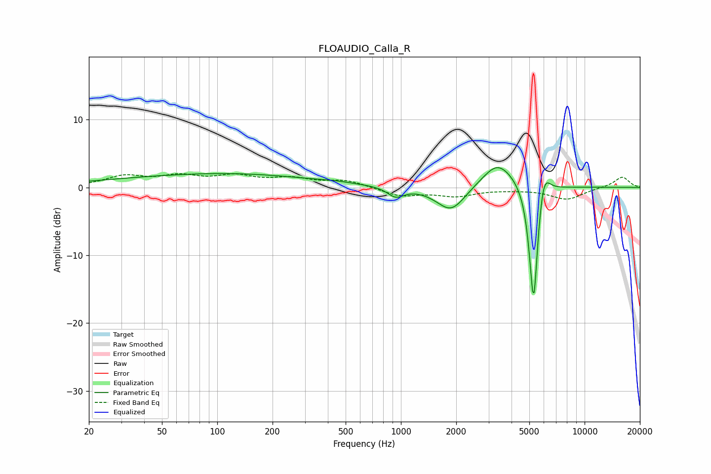

# FLOAUDIO_Calla_R
See [usage instructions](https://github.com/jaakkopasanen/AutoEq#usage) for more options and info.

### Parametric EQs
Apply preamp of -3.0 dB when using parametric equalizer.

|   # | Type    |   Fc (Hz) |    Q |   Gain (dB) |
|-----|---------|-----------|------|-------------|
|   1 | Peaking |        72 | 0.25 |         1.4 |
|   2 | Peaking |       168 | 0.32 |         0.7 |
|   3 | Peaking |       446 | 1.82 |         0.1 |
|   4 | Peaking |       937 | 3.19 |        -1.4 |
|   5 | Peaking |      1878 | 1.75 |        -3.9 |
|   6 | Peaking |      3287 | 2.91 |         0.6 |
|   7 | Peaking |      3448 | 1.34 |         3.6 |
|   8 | Peaking |      5204 | 6    |        -3.9 |
|   9 | Peaking |      5290 | 6    |       -15.2 |
|  10 | Peaking |      5986 | 4.42 |         4.3 |

### Fixed Band EQs
When using fixed band (also called graphic) equalizer, apply preamp of **-2.1 dB** (if available) and set gains manually with these parameters.

|   # | Type    |   Fc (Hz) |    Q |   Gain (dB) |
|-----|---------|-----------|------|-------------|
|   1 | Peaking |        31 | 1.41 |         1.5 |
|   2 | Peaking |        62 | 1.41 |         1.4 |
|   3 | Peaking |       125 | 1.41 |         1.5 |
|   4 | Peaking |       250 | 1.41 |         1.1 |
|   5 | Peaking |       500 | 1.41 |         1   |
|   6 | Peaking |      1000 | 1.41 |        -1.2 |
|   7 | Peaking |      2000 | 1.41 |        -1.1 |
|   8 | Peaking |      4000 | 1.41 |        -0.2 |
|   9 | Peaking |      8000 | 1.41 |        -1.7 |
|  10 | Peaking |     16000 | 1.41 |         1.6 |

### Graphs

