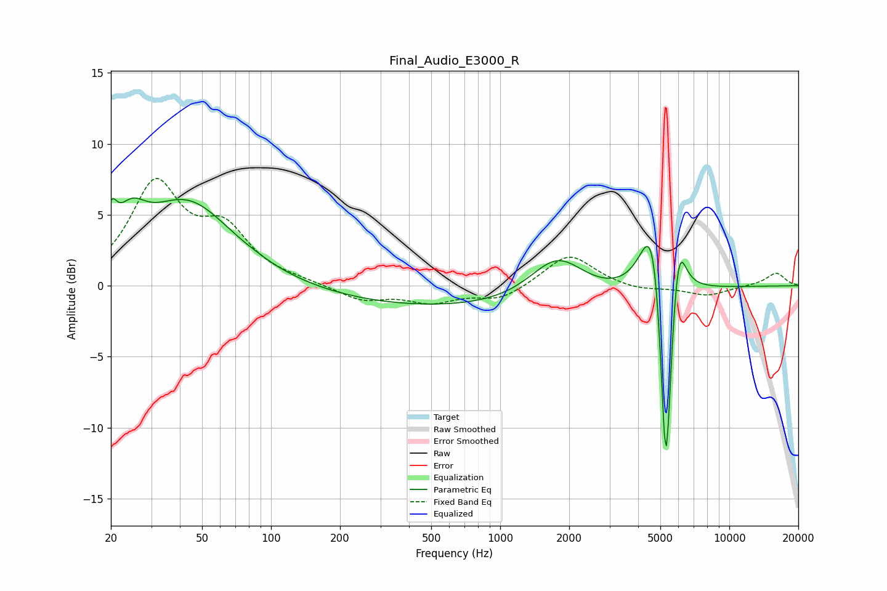

# Final_Audio_E3000_R
See [usage instructions](https://github.com/jaakkopasanen/AutoEq#usage) for more options and info.

### Parametric EQs
Apply preamp of -6.3 dB when using parametric equalizer.

|   # | Type    |   Fc (Hz) |    Q |   Gain (dB) |
|-----|---------|-----------|------|-------------|
|   1 | Peaking |        20 | 6    |         2.3 |
|   2 | Peaking |        24 | 2.23 |         2.5 |
|   3 | Peaking |        43 | 0.71 |         5.8 |
|   4 | Peaking |        87 | 3.2  |         0   |
|   5 | Peaking |       845 | 0.18 |        -1.7 |
|   6 | Peaking |      1774 | 1.17 |         3.2 |
|   7 | Peaking |      4631 | 2.74 |         6.1 |
|   8 | Peaking |      5283 | 6    |       -11.8 |
|   9 | Peaking |      5304 | 6    |        -4.6 |
|  10 | Peaking |      5996 | 4.43 |         4.3 |

### Fixed Band EQs
When using fixed band (also called graphic) equalizer, apply preamp of **-7.7 dB** (if available) and set gains manually with these parameters.

|   # | Type    |   Fc (Hz) |    Q |   Gain (dB) |
|-----|---------|-----------|------|-------------|
|   1 | Peaking |        31 | 1.41 |         6.9 |
|   2 | Peaking |        62 | 1.41 |         3.5 |
|   3 | Peaking |       125 | 1.41 |         0.2 |
|   4 | Peaking |       250 | 1.41 |        -1   |
|   5 | Peaking |       500 | 1.41 |        -1.1 |
|   6 | Peaking |      1000 | 1.41 |        -1   |
|   7 | Peaking |      2000 | 1.41 |         2.3 |
|   8 | Peaking |      4000 | 1.41 |        -0.4 |
|   9 | Peaking |      8000 | 1.41 |        -0.7 |
|  10 | Peaking |     16000 | 1.41 |         0.9 |

### Graphs

