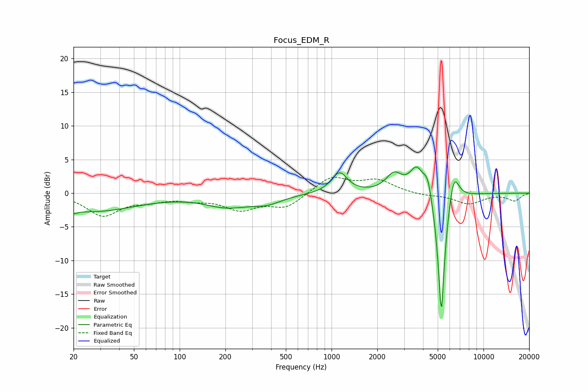

# Focus_EDM_R
See [usage instructions](https://github.com/jaakkopasanen/AutoEq#usage) for more options and info.

### Parametric EQs
Apply preamp of -4.0 dB when using parametric equalizer.

|   # | Type    |   Fc (Hz) |    Q |   Gain (dB) |
|-----|---------|-----------|------|-------------|
|   1 | Peaking |        20 | 5.96 |        -0.5 |
|   2 | Peaking |        26 | 0.46 |        -2.7 |
|   3 | Peaking |       206 | 0.95 |        -1.8 |
|   4 | Peaking |       375 | 1.42 |        -1.1 |
|   5 | Peaking |      1126 | 2.71 |         3.1 |
|   6 | Peaking |      2578 | 2.66 |         2.7 |
|   7 | Peaking |      3632 | 3.09 |         3.8 |
|   8 | Peaking |      4308 | 4.71 |         3.3 |
|   9 | Peaking |      5280 | 5.81 |       -20   |
|  10 | Peaking |      6367 | 3.91 |         5   |

### Fixed Band EQs
When using fixed band (also called graphic) equalizer, apply preamp of **-2.4 dB** (if available) and set gains manually with these parameters.

|   # | Type    |   Fc (Hz) |    Q |   Gain (dB) |
|-----|---------|-----------|------|-------------|
|   1 | Peaking |        31 | 1.41 |        -3.2 |
|   2 | Peaking |        62 | 1.41 |        -0.9 |
|   3 | Peaking |       125 | 1.41 |        -0.7 |
|   4 | Peaking |       250 | 1.41 |        -2.2 |
|   5 | Peaking |       500 | 1.41 |        -2.1 |
|   6 | Peaking |      1000 | 1.41 |         2.4 |
|   7 | Peaking |      2000 | 1.41 |         1.8 |
|   8 | Peaking |      4000 | 1.41 |        -0.3 |
|   9 | Peaking |      8000 | 1.41 |        -1.6 |
|  10 | Peaking |     16000 | 1.41 |        -1.1 |

### Graphs

