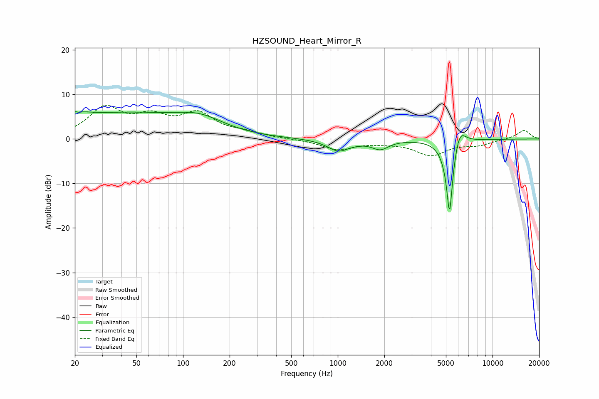

# HZSOUND_Heart_Mirror_R
See [usage instructions](https://github.com/jaakkopasanen/AutoEq#usage) for more options and info.

### Parametric EQs
Apply preamp of -6.3 dB when using parametric equalizer.

|   # | Type    |   Fc (Hz) |    Q |   Gain (dB) |
|-----|---------|-----------|------|-------------|
|   1 | Peaking |        20 | 5.78 |         2.5 |
|   2 | Peaking |        20 | 5.96 |        -2.2 |
|   3 | Peaking |        21 | 1.63 |         1.7 |
|   4 | Peaking |        42 | 0.35 |         5.4 |
|   5 | Peaking |       128 | 0.92 |         2.9 |
|   6 | Peaking |      1036 | 1.93 |        -3.1 |
|   7 | Peaking |      1115 | 2.93 |         0.5 |
|   8 | Peaking |      1884 | 2.66 |        -2   |
|   9 | Peaking |      5279 | 6    |       -18.2 |
|  10 | Peaking |      6092 | 3.49 |         4.8 |

### Fixed Band EQs
When using fixed band (also called graphic) equalizer, apply preamp of **-7.7 dB** (if available) and set gains manually with these parameters.

|   # | Type    |   Fc (Hz) |    Q |   Gain (dB) |
|-----|---------|-----------|------|-------------|
|   1 | Peaking |        31 | 1.41 |         6.6 |
|   2 | Peaking |        62 | 1.41 |         4.1 |
|   3 | Peaking |       125 | 1.41 |         5.2 |
|   4 | Peaking |       250 | 1.41 |         1.2 |
|   5 | Peaking |       500 | 1.41 |        -0   |
|   6 | Peaking |      1000 | 1.41 |        -2.3 |
|   7 | Peaking |      2000 | 1.41 |        -0.5 |
|   8 | Peaking |      4000 | 1.41 |        -3.5 |
|   9 | Peaking |      8000 | 1.41 |        -1.2 |
|  10 | Peaking |     16000 | 1.41 |         2   |

### Graphs

