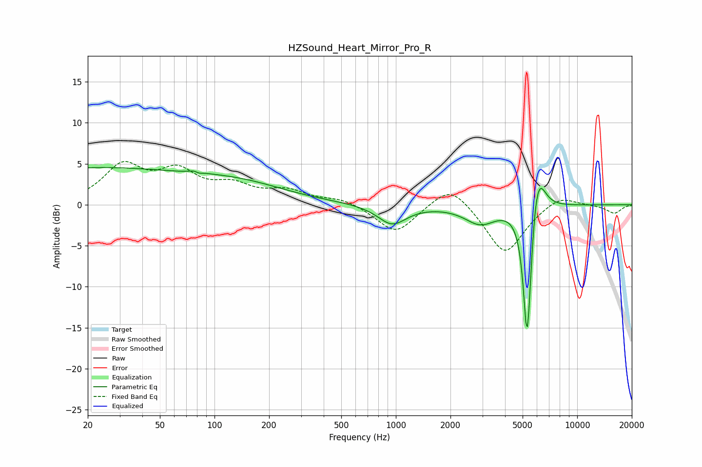

# HZSound_Heart_Mirror_Pro_R
See [usage instructions](https://github.com/jaakkopasanen/AutoEq#usage) for more options and info.

### Parametric EQs
Apply preamp of -4.6 dB when using parametric equalizer.

|   # | Type    |   Fc (Hz) |    Q |   Gain (dB) |
|-----|---------|-----------|------|-------------|
|   1 | Peaking |        20 | 0.23 |         4.4 |
|   2 | Peaking |        80 | 5.55 |         3.3 |
|   3 | Peaking |        81 | 5.83 |        -3.2 |
|   4 | Peaking |       141 | 0.54 |         2   |
|   5 | Peaking |       953 | 1.79 |        -2.4 |
|   6 | Peaking |      2925 | 1.64 |        -2.2 |
|   7 | Peaking |      5279 | 6    |       -14.8 |
|   8 | Peaking |      5428 | 6    |        -4.9 |
|   9 | Peaking |      5766 | 3.38 |         4.7 |
|  10 | Peaking |      6149 | 3.67 |         2.9 |

### Fixed Band EQs
When using fixed band (also called graphic) equalizer, apply preamp of **-5.4 dB** (if available) and set gains manually with these parameters.

|   # | Type    |   Fc (Hz) |    Q |   Gain (dB) |
|-----|---------|-----------|------|-------------|
|   1 | Peaking |        31 | 1.41 |         4.5 |
|   2 | Peaking |        62 | 1.41 |         3.6 |
|   3 | Peaking |       125 | 1.41 |         2   |
|   4 | Peaking |       250 | 1.41 |         1.5 |
|   5 | Peaking |       500 | 1.41 |         0.7 |
|   6 | Peaking |      1000 | 1.41 |        -3.5 |
|   7 | Peaking |      2000 | 1.41 |         2.9 |
|   8 | Peaking |      4000 | 1.41 |        -6.1 |
|   9 | Peaking |      8000 | 1.41 |         1.4 |
|  10 | Peaking |     16000 | 1.41 |        -1   |

### Graphs

