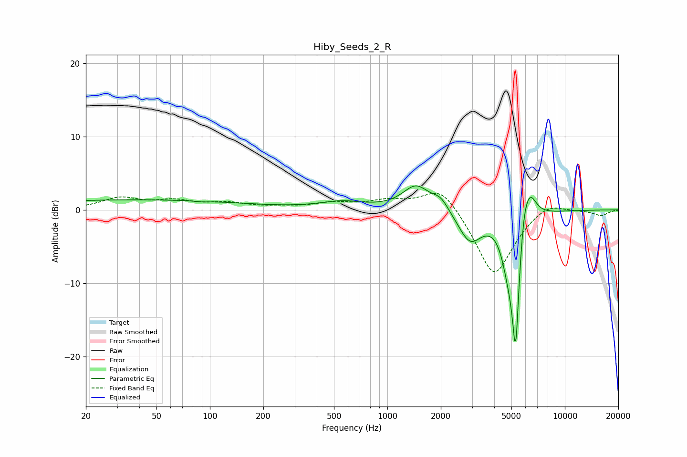

# Hiby_Seeds_2_R
See [usage instructions](https://github.com/jaakkopasanen/AutoEq#usage) for more options and info.

### Parametric EQs
Apply preamp of -3.4 dB when using parametric equalizer.

|   # | Type    |   Fc (Hz) |    Q |   Gain (dB) |
|-----|---------|-----------|------|-------------|
|   1 | Peaking |        37 | 0.2  |         1.4 |
|   2 | Peaking |        91 | 4.58 |        -0.1 |
|   3 | Peaking |       553 | 1.16 |         1   |
|   4 | Peaking |      1452 | 1.87 |         3.3 |
|   5 | Peaking |      1999 | 3.06 |         1.5 |
|   6 | Peaking |      2921 | 2.09 |        -4.2 |
|   7 | Peaking |      4795 | 3.72 |        -4.1 |
|   8 | Peaking |      5280 | 5.91 |       -18.2 |
|   9 | Peaking |      5866 | 5.09 |         3.8 |
|  10 | Peaking |      6349 | 3.55 |         4   |

### Fixed Band EQs
When using fixed band (also called graphic) equalizer, apply preamp of **-2.4 dB** (if available) and set gains manually with these parameters.

|   # | Type    |   Fc (Hz) |    Q |   Gain (dB) |
|-----|---------|-----------|------|-------------|
|   1 | Peaking |        31 | 1.41 |         1.5 |
|   2 | Peaking |        62 | 1.41 |         1.1 |
|   3 | Peaking |       125 | 1.41 |         0.8 |
|   4 | Peaking |       250 | 1.41 |         0.3 |
|   5 | Peaking |       500 | 1.41 |         0.8 |
|   6 | Peaking |      1000 | 1.41 |         1.1 |
|   7 | Peaking |      2000 | 1.41 |         3.6 |
|   8 | Peaking |      4000 | 1.41 |        -9.3 |
|   9 | Peaking |      8000 | 1.41 |         1.5 |
|  10 | Peaking |     16000 | 1.41 |        -0.7 |

### Graphs

