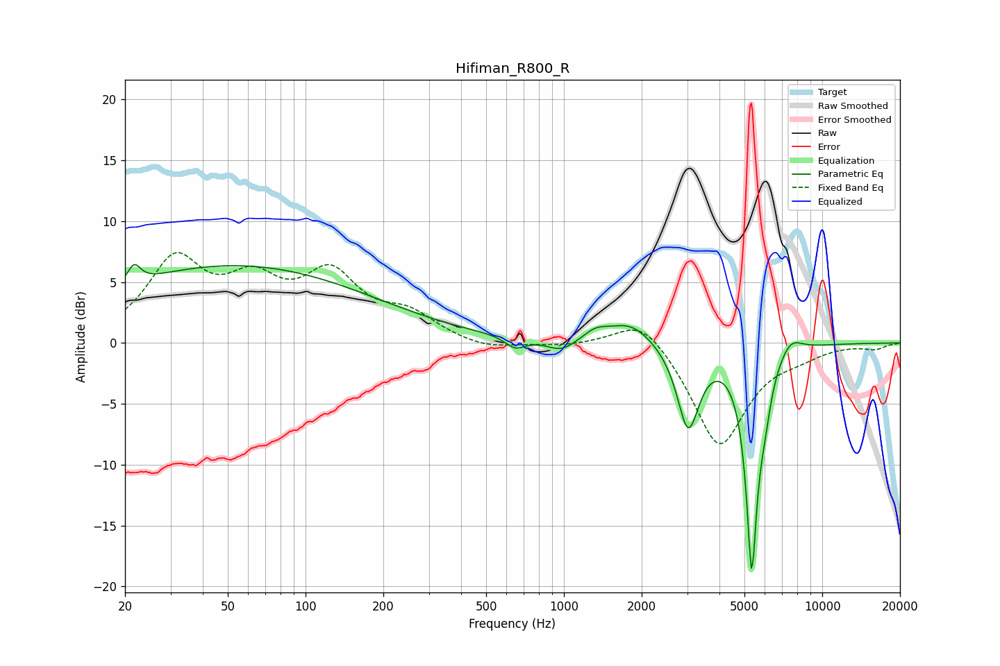

# Hifiman_R800_R
See [usage instructions](https://github.com/jaakkopasanen/AutoEq#usage) for more options and info.

### Parametric EQs
Apply preamp of -6.5 dB when using parametric equalizer.

|   # | Type    |   Fc (Hz) |    Q |   Gain (dB) |
|-----|---------|-----------|------|-------------|
|   1 | Peaking |        22 | 5.77 |         1.5 |
|   2 | Peaking |        53 | 0.26 |         6.3 |
|   3 | Peaking |       649 | 3.64 |        -0.9 |
|   4 | Peaking |       977 | 2.51 |        -1   |
|   5 | Peaking |      1328 | 3.02 |         0.8 |
|   6 | Peaking |      1809 | 1.62 |         1.8 |
|   7 | Peaking |      3028 | 3.32 |        -6.9 |
|   8 | Peaking |      5335 | 6    |       -17.9 |
|   9 | Peaking |      5983 | 5.34 |        -2.3 |
|  10 | Peaking |      7524 | 2.99 |         1.3 |

### Fixed Band EQs
When using fixed band (also called graphic) equalizer, apply preamp of **-7.5 dB** (if available) and set gains manually with these parameters.

|   # | Type    |   Fc (Hz) |    Q |   Gain (dB) |
|-----|---------|-----------|------|-------------|
|   1 | Peaking |        31 | 1.41 |         6.4 |
|   2 | Peaking |        62 | 1.41 |         4.1 |
|   3 | Peaking |       125 | 1.41 |         5.1 |
|   4 | Peaking |       250 | 1.41 |         2   |
|   5 | Peaking |       500 | 1.41 |        -0.6 |
|   6 | Peaking |      1000 | 1.41 |        -0.2 |
|   7 | Peaking |      2000 | 1.41 |         2.5 |
|   8 | Peaking |      4000 | 1.41 |        -8.6 |
|   9 | Peaking |      8000 | 1.41 |        -0.7 |
|  10 | Peaking |     16000 | 1.41 |        -0.4 |

### Graphs

